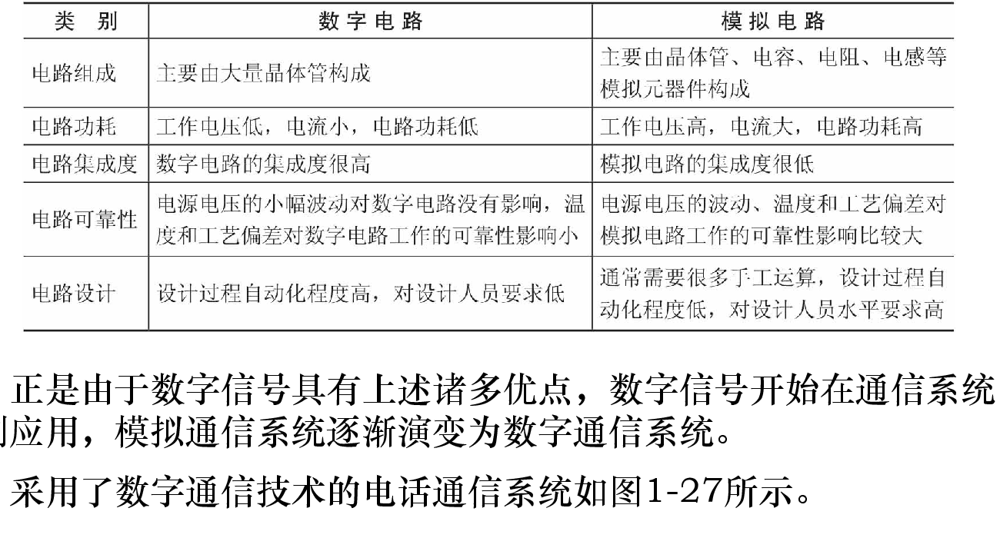
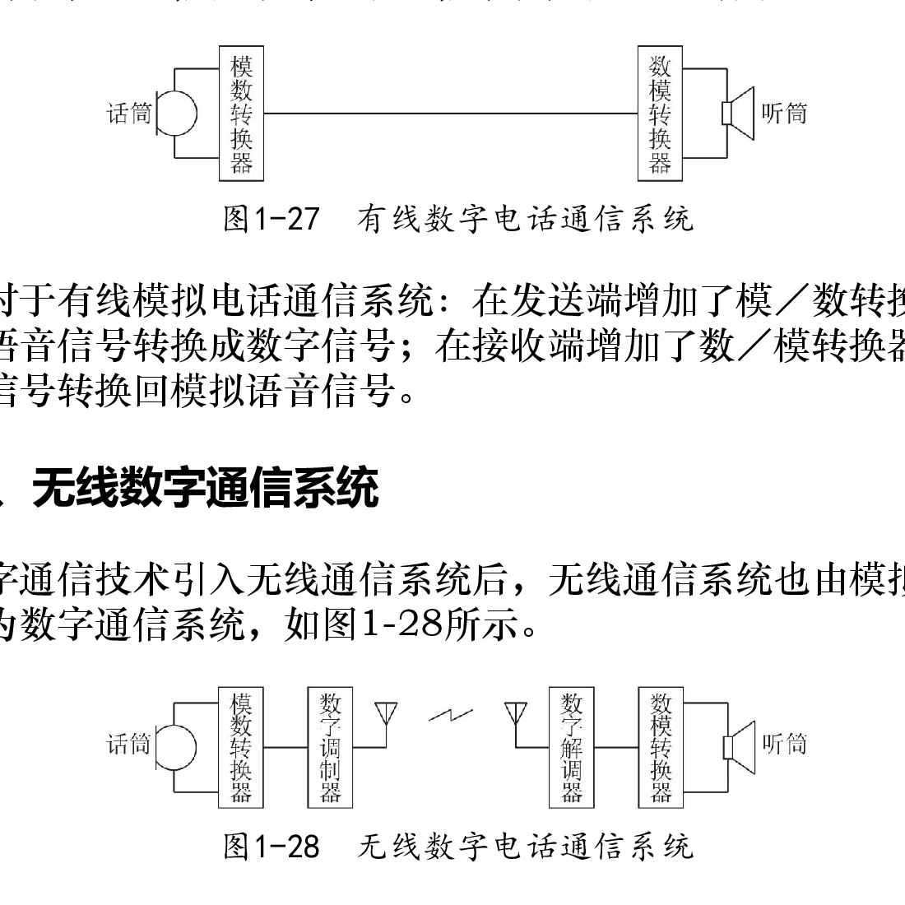
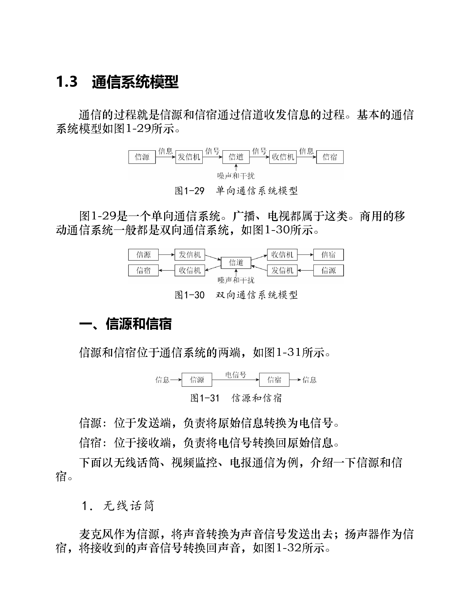
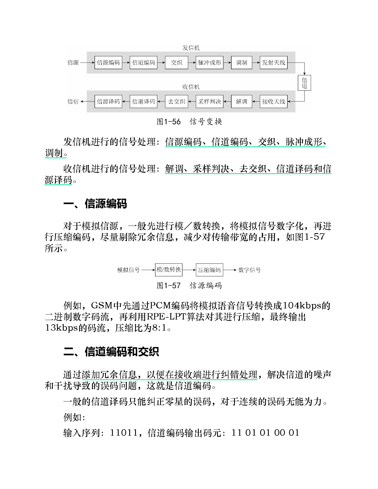
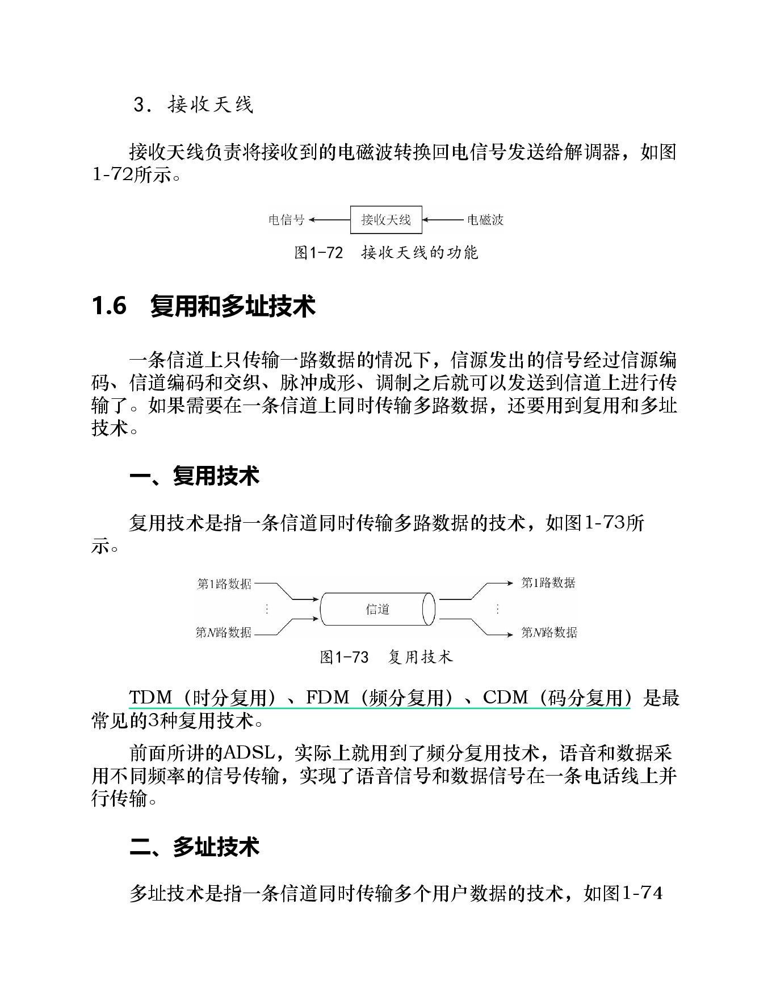

# 第1章 通信原理概述

## 知识点

### 1.1 什么是通信
- [ ] 一、广义的通信
- [ ] 二、狭义的通信

### 1.2 什么是通信系统
- [ ] 一、有线模拟通信系统
- [ ] 二、无线模拟通信系统
- [ ] 三、有线数字通信系统
- [ ] 四、无线数字通信系统

**数字电路与模拟电路的差异**



*图示要点：数字电路在集成度、功耗、可靠性及设计自动化方面具有优势，这是通信系统由模拟走向数字的工程基础。*

**数字电话通信系统**



*图示要点：有线数字系统在两端进行模/数与数/模转换；无线系统还需经数字调制、无线信道和数字解调。*

### 1.3 通信系统模型
- [ ] 一、信源和信宿
- [ ] 二、信道
- [ ] 三、发信机和收信机

### 1.4 信道
- [ ] 一、有线信道
- [ ] 二、无线信道

### 1.5 信号变换
- [ ] 一、信源编码
- [ ] 二、信道编码和交织
- [ ] 三、脉冲成形
- [ ] 四、调制
- [ ] 五、天线技术

### 1.6 复用和多址技术
- [ ] 一、复用技术
- [ ] 二、多址技术
![[截屏2026-07-18 10.12.27.png]]

---

## 正文

### 1.1 什么是通信

通信的本质是**信息的传递与交流**。广义上，人、动物或机器之间只要发生信息交换，都可以看作通信；狭义上，本书讨论的是利用电、光或电磁波等信号，把消息从一端可靠地传到另一端的技术。

应区分三个概念：

| 概念 | 含义 | 例子 |
|---|---|---|
| 信息 | 要表达的内容 | 语音、文字、图像、传感器读数 |
| 信号 | 信息的物理载体 | 电压、电流、光强、电磁波 |
| 通信 | 对信号进行变换、传输和恢复的过程 | 手机通话、RFID 读写 |

### 1.2 通信系统的演变：模拟到数字

模拟系统直接处理连续变化的语音或图像电信号；数字系统先把模拟消息采样、量化、编码为比特，再进行传输。数字通信能够再生判决、便于纠错与加密，因此成为现代通信系统的主流。

| 系统 | 典型链路 | 核心特点 |
|---|---|---|
| 有线模拟 | 话筒 → 电话线 → 听筒 | 电路简单，但失真会逐段累积 |
| 无线模拟 | 话筒 → 调制 → 天线/空间 → 解调 → 听筒 | 可远距离无线传输，但易受噪声和衰落影响 |
| 有线数字 | A/D → 数字传输/再生 → D/A | 可用判决恢复 0/1，便于复用和纠错 |
| 无线数字 | A/D → 数字调制 → 无线信道 → 数字解调 → D/A | 现代蜂窝、Wi‑Fi、RFID 的基本形态 |

### 1.3 通信系统模型

单向系统的信息流为：

```text
信源 → 发信机 → 信道 → 收信机 → 信宿
```

- **信源**：产生消息，如话筒、摄像头、RFID 标签存储器；
- **发信机**：把消息处理成适合信道传输的信号；
- **信道**：信号传播的媒介，同时会引入噪声、衰落和失真；
- **收信机**：从受损信号中恢复消息；
- **信宿**：消息的最终使用者，如听筒、显示器或读写器应用程序。



广播、电视属于典型单向通信；手机、读写器与标签的交互属于双向通信。

### 1.4 信道

信道既指传输媒介，也包括它对信号造成的影响。

| 类型 | 例子 | 主要特点 |
|---|---|---|
| 有线信道 | 双绞线、同轴电缆、光纤 | 传播路径可控，干扰相对容易管理 |
| 无线信道 | 空气、自由空间 | 有路径损耗、遮挡、多径和多普勒效应 |

信道的带宽有限，且会引入噪声；因此发射机不能只“发得出去”，还必须让信号的带宽、功率和调制方式匹配信道条件。

### 1.5 信号变换

发送端和接收端是一对相反的处理链。典型数字链路可概括为：

```text
消息 → 信源编码 → 信道编码/交织 → 脉冲成形 → 调制 → 天线
     → 无线/有线信道 → 天线 → 解调 → 采样判决 → 去交织/译码 → 信源译码 → 消息
```



各环节的目标不同：信源编码去除消息冗余，信道编码增加可纠错冗余，脉冲成形控制带宽和码间串扰，调制把基带搬移到适合传输的频段，天线完成电信号与电磁波的转换。

### 1.6 复用与多址技术

二者都在共享资源，但对象不同：

| 技术 | 要解决的问题 | 资源分配对象 |
|---|---|---|
| 复用 | 一条链路如何同时承载多路业务 | 多路信号 |
| 多址 | 多个用户如何共同使用系统资源 | 多个用户 |

可按照时间、频率或码字区分资源，分别得到 TDM/TDMA、FDM/FDMA、CDM/CDMA。RFID 的防碰撞主要体现为时隙上的多址协调。



### 本章小结

通信系统的任务是把信息映射为可在信道中传播的信号，并在接收端尽可能可靠地恢复。后续章节分别展开信号与频谱、信道、编码、调制、天线以及多址技术；它们共同回答“如何传得更快、更可靠、更省频谱”。
