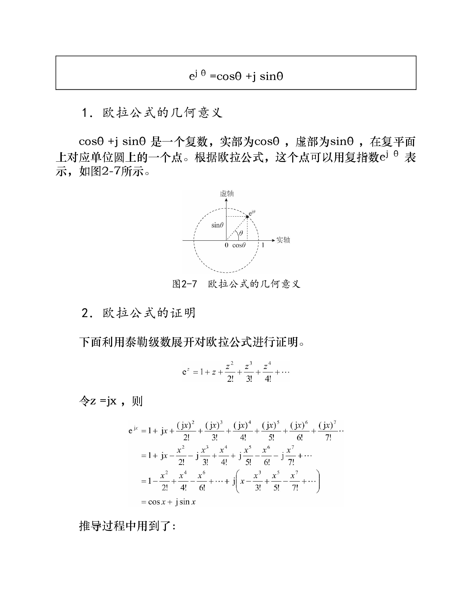
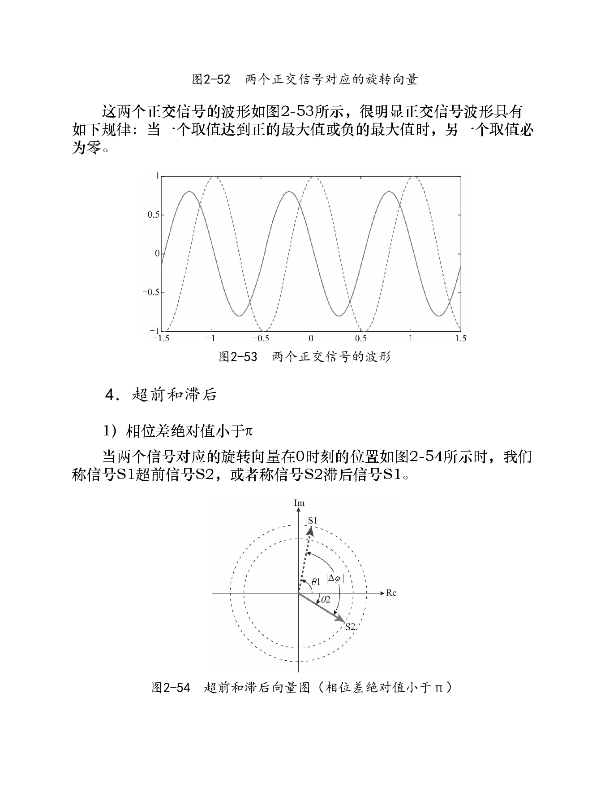
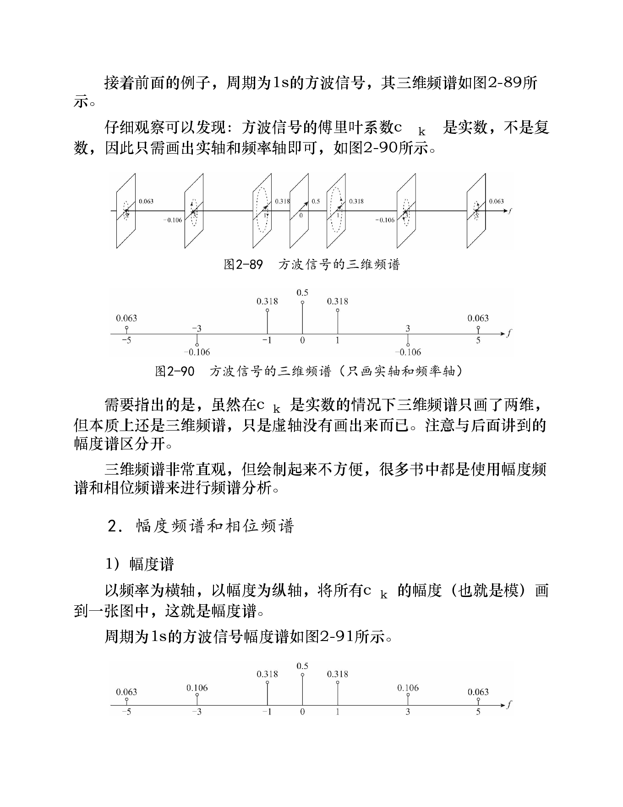
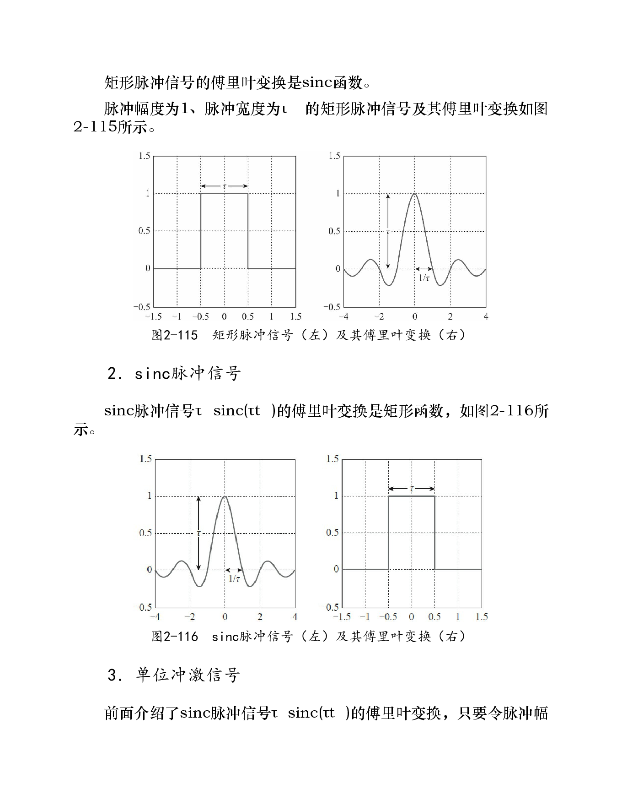
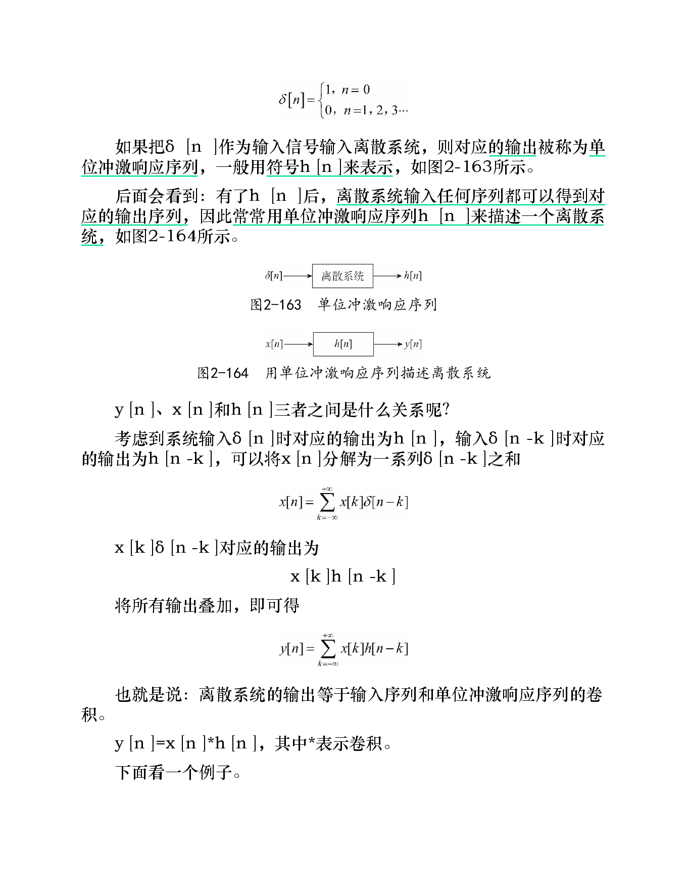

# 第2章 信号与频谱

## 知识点

> 本节已将原截图中的公式和结论转写为 Markdown / LaTeX，并补齐缺失公式。后续可继续按“概念 → 公式 → 直观解释 → 与 RFID 的关系”的方式追加。

### 1. 复信号与复指数

#### 1.1 复信号的含义

复信号本质上可以看作两路实信号的并行表示：

$$
x(t)=x_I(t)+j x_Q(t)
$$

其中：

- $x_I(t)$：同相分量（I, In-phase）
- $x_Q(t)$：正交分量（Q, Quadrature）

所谓“复信号”，并不意味着物理世界中真的存在复数信号，而是用复数形式同时描述两路正交实信号，便于表达幅度、相位和频率搬移。

#### 1.2 复指数相乘的几何意义

复数与复指数 $e^{j\theta}$ 相乘，相当于对复数对应的向量做角度为 $\theta$ 的旋转：

- $\theta>0$：逆时针旋转
- $\theta<0$：顺时针旋转

若：

$$
z=r e^{j\varphi}
$$

则：

$$
z e^{j\theta}=r e^{j(\varphi+\theta)}
$$

所以复指数乘法的核心作用是“改变相位”。这也是后面“时域延迟等价于频域相位旋转”的基础。

#### 1.3 欧拉公式

$$
e^{j\theta}=\cos\theta+j\sin\theta
$$

$$
e^{-j\theta}=\cos\theta-j\sin\theta
$$

两式相加、相减可得：

$$
\cos\theta=\frac{e^{j\theta}+e^{-j\theta}}{2}
$$

$$
\sin\theta=\frac{e^{j\theta}-e^{-j\theta}}{2j}
$$

因此余弦信号可以分解为一对正负频率的复指数信号。

---

### 2. 正交性

#### 2.1 复指数函数的正交性

在一个基波周期 $T_0$ 内，不同频率的复指数信号彼此正交：

$$
\int_{T_0} e^{jm\omega_0 t}e^{-jn\omega_0 t}\,dt=0,\quad m\ne n
$$

同一个复指数信号与自身共轭相乘，在一个基波周期内的积分为 $T_0$：

$$
\int_{T_0} e^{jm\omega_0 t}e^{-jm\omega_0 t}\,dt=T_0
$$

统一写法：

$$
\int_{T_0} e^{jm\omega_0 t}e^{-jn\omega_0 t}\,dt=
\begin{cases}
T_0, & m=n\\
0, & m\ne n
\end{cases}
$$

#### 2.2 为什么正交性重要

傅里叶级数之所以能把一个周期信号拆成许多复指数分量，是因为这些复指数基函数相互正交。正交性使得每个频率分量的系数可以被单独“投影”出来，而不会被其他频率分量干扰。

---

### 3. 波的相位与相干叠加

假设波源在原地做周期性简谐运动，初始相位为 $\varphi$，则波源振动方程为：

$$
y_{\text{源}}(t)=A\sin(2\pi f t+\varphi)
$$

若波速为 $v$，波源到观察点的距离为 $d$，则传播延迟为：

$$
\Delta t=\frac{d}{v}
$$

观察点在 $t$ 时刻的状态等价于波源在 $t-\Delta t$ 时刻的状态，因此：

$$
s(t)=A\sin\left[2\pi f\left(t-\frac{d}{v}\right)+\varphi\right]
$$

又因为：

$$
v=f\lambda
$$

所以：

$$
s(t)=A\sin\left(2\pi f t-\frac{2\pi d}{\lambda}+\varphi\right)
$$

其中 $-\frac{2\pi d}{\lambda}$ 表示传播距离带来的相位滞后。

若两个波到达同一点的路程差为整数倍波长：

$$
\Delta d=n\lambda
$$

则相位差为：

$$
\Delta\phi=\frac{2\pi\Delta d}{\lambda}=2\pi n
$$

此时两列波同相叠加，产生相干加强。

---

### 4. 傅里叶级数：周期信号的频谱

#### 4.1 周期信号的复指数展开

周期信号 $f(t)$ 可以展开为无穷多个复指数信号的加权和：

$$
f(t)=\sum_{k=-\infty}^{+\infty} c_k e^{jk\omega_0 t}
$$

其中：

- $\omega_0=\frac{2\pi}{T}$：基波角频率
- $T$：信号周期
- $c_k$：第 $k$ 条谱线对应的傅里叶系数

这说明：一个复杂周期波形可以看作直流分量和一系列谐波分量的叠加。

#### 4.2 傅里叶系数公式

$$
c_k=\frac{1}{T}\int_{-T/2}^{T/2} f(t)e^{-jk\omega_0 t}\,dt,\quad k=0,\pm1,\pm2,\dots
$$

直观理解：$c_k$ 是信号 $f(t)$ 在基函数 $e^{jk\omega_0t}$ 上的投影。

---

### 5. 方波 / 矩形脉冲周期信号的傅里叶系数

#### 5.1 幅度为 1、占空比为 $1/2$ 的方波

设方波周期为 $T$，脉宽为 $\tau$，幅度为 1，占空比为：

$$
\frac{\tau}{T}=\frac{1}{2}
$$

直流分量为：

$$
c_0=\frac{1}{T}\int_{-\tau/2}^{\tau/2}1\,dt=\frac{\tau}{T}=0.5
$$

对 $k\ne 0$：

$$
c_k=\frac{1}{T}\int_{-\tau/2}^{\tau/2}e^{-jk\omega_0t}\,dt
$$

展开：

$$
c_k=\frac{1}{T}\int_{-\tau/2}^{\tau/2}\left(\cos k\omega_0t-j\sin k\omega_0t\right)dt
$$

由于 $\sin(k\omega_0t)$ 是奇函数，在对称区间积分为 0，因此：

$$
c_k=\frac{1}{T}\int_{-\tau/2}^{\tau/2}\cos(k\omega_0t)dt
$$

$$
c_k=\frac{2}{T}\int_{0}^{\tau/2}\cos(k\omega_0t)dt
$$

$$
c_k=\frac{2}{T}\cdot\frac{\sin(k\omega_0\tau/2)}{k\omega_0}
$$

$$
c_k=\frac{\sin(k\omega_0\tau/2)}{k\omega_0T/2}
$$

当 $T=2\tau$、$\omega_0=2\pi/T=\pi/\tau$ 时：

$$
c_k=\frac{1}{2}\cdot\frac{\sin(k\pi/2)}{k\pi/2}
$$

引入 sinc 函数后：

$$
c_k=\frac{1}{2}\operatorname{sinc}\left(\frac{k}{2}\right)
$$

#### 5.2 sinc 函数

本文采用归一化 sinc 定义：

$$
\operatorname{sinc}(x)=\frac{\sin(\pi x)}{\pi x}
$$

性质：

- 当 $x=\pm1,\pm2,\pm3,\dots$ 时：

$$
\operatorname{sinc}(x)=0
$$

- 当 $x\to0$ 时：

$$
\sin(\pi x)\to \pi x
$$

所以：

$$
\operatorname{sinc}(0)=1
$$

#### 5.3 幅度为 1、占空比为 $1/n$ 的周期矩形信号

若矩形脉冲的占空比为：

$$
\frac{\tau}{T}=\frac{1}{n}
$$

则傅里叶系数为：

$$
c_k=\frac{1}{n}\operatorname{sinc}\left(\frac{k}{n}\right)
$$

结论：幅度为 1 的周期矩形信号，其傅里叶系数只与占空比有关。

---

### 6. 余弦信号的频谱

余弦信号：

$$
f(t)=\cos\omega_0t
$$

由欧拉公式可得：

$$
f(t)=\frac{1}{2}e^{j\omega_0t}+\frac{1}{2}e^{-j\omega_0t}
$$

因此余弦信号的频谱只有两条谱线：

- $+\omega_0$ 处幅度为 $1/2$
- $-\omega_0$ 处幅度为 $1/2$

这体现了实余弦信号可以看作正频率和负频率两个复指数信号的叠加。

---

### 7. 从傅里叶级数到傅里叶变换

#### 7.1 周期变大时频谱的变化

对周期信号而言，频谱是离散谱线。周期 $T$ 越大，基频间隔越小：

$$
f_0=\frac{1}{T}
$$

周期每扩大一倍：

- 谱线数量在同一频率范围内约扩大一倍；
- 谱线间隔减小一半；
- 每条谱线的长度也随之减小。

当周期 $T\to\infty$ 时，周期信号趋向非周期信号，离散谱线逐渐变成连续频谱，由此得到傅里叶变换。

#### 7.2 傅里叶正变换

若 $x(t)$ 为非周期信号，则其傅里叶变换定义为：

$$
X(f)=\int_{-\infty}^{+\infty}x(t)e^{-j2\pi ft}\,dt
$$

推导思路：

1. 先把非周期信号 $x(t)$ 周期延拓为周期信号 $x_T(t)$。
2. 周期信号的傅里叶系数为：

$$
c_k=\frac{1}{T}\int_{-T/2}^{T/2}x_T(t)e^{-jk\omega_0t}\,dt
$$

3. 代入 $T=1/f_0$、$\omega_0=2\pi f_0$：

$$
c_k=f_0\int_{-T/2}^{T/2}x_T(t)e^{-j2\pi kf_0t}\,dt
$$

4. 当 $T\to\infty$、$f_0\to0$，$kf_0$ 变成连续频率 $f$，得到：

$$
X(f)=\int_{-\infty}^{+\infty}x(t)e^{-j2\pi ft}\,dt
$$

这就是傅里叶正变换。

#### 7.3 傅里叶逆变换

傅里叶逆变换用于由频域函数 $X(f)$ 恢复时域信号 $x(t)$：

$$
x(t)=\int_{-\infty}^{+\infty}X(f)e^{j2\pi ft}\,df
$$

推导思路：

周期信号有：

$$
x_T(t)=\sum_{k=-\infty}^{+\infty}c_ke^{j2\pi kf_0t}
$$

由正变换推导可知：

$$
c_k=f_0X(kf_0)
$$

代入得：

$$
x_T(t)=\sum_{k=-\infty}^{+\infty}f_0X(kf_0)e^{j2\pi kf_0t}
$$

当 $T\to\infty$、$f_0\to0$ 时，上式的求和变成积分：

$$
x(t)=\int_{-\infty}^{+\infty}X(f)e^{j2\pi ft}\,df
$$

这就是傅里叶逆变换。

#### 7.4 傅里叶变换对

$$
x(t)\xleftrightarrow{\mathcal{F}}X(f)
$$

$$
X(f)=\int_{-\infty}^{+\infty}x(t)e^{-j2\pi ft}\,dt
$$

$$
x(t)=\int_{-\infty}^{+\infty}X(f)e^{j2\pi ft}\,df
$$

---

### 8. 周期信号的傅里叶变换

周期信号的傅里叶变换由一系列冲激函数构成，冲激位于基波及各谐波频率处，冲激强度是傅里叶级数系数 $c_k$。

若：

$$
x_T(t)=\sum_{k=-\infty}^{+\infty}c_ke^{j2\pi kf_0t}
$$

则：

$$
X_T(f)=\sum_{k=-\infty}^{+\infty}c_k\delta(f-kf_0)
$$

含义：周期信号在频域不是连续谱，而是在 $f=kf_0$ 处的一系列谱线。

---

### 9. 傅里叶变换性质

#### 9.1 时移特性

若：

$$
x(t)\xleftrightarrow{\mathcal{F}}X(f)
$$

则：

$$
x(t-t_0)\xleftrightarrow{\mathcal{F}}X(f)e^{-j2\pi f t_0}
$$

也就是说，时域延迟不会改变频谱幅度，只会引入频域相位旋转：

$$
|X(f)e^{-j2\pi f t_0}|=|X(f)|
$$

时域延迟越大，频域相位随频率旋转得越快。

#### 9.2 对偶性

如果：

$$
x(t)\xleftrightarrow{\mathcal{F}}Y(f)
$$

则：

$$
Y(t)\xleftrightarrow{\mathcal{F}}x(-f)
$$

直观理解：时域和频域在傅里叶变换中具有某种对称性。如果一个函数的频谱形状已知，那么把频谱函数当作时域函数再做傅里叶变换，会得到原函数的反向版本。

#### 9.3 时域卷积定理

若：

$$
x(t)\xleftrightarrow{\mathcal{F}}X(f),\quad y(t)\xleftrightarrow{\mathcal{F}}Y(f)
$$

则：

$$
x(t)*y(t)\xleftrightarrow{\mathcal{F}}X(f)Y(f)
$$

其中卷积定义为：

$$
(x*y)(t)=\int_{-\infty}^{+\infty}x(\tau)y(t-\tau)\,d\tau
$$

也就是说，两个信号在时域做卷积，等价于它们的频谱在频域做乘法。

#### 9.4 频域卷积定理

若：

$$
x(t)\xleftrightarrow{\mathcal{F}}X(f),\quad y(t)\xleftrightarrow{\mathcal{F}}Y(f)
$$

则在以 $f$ 为频率变量、正变换核为 $e^{-j2\pi ft}$ 的约定下：

$$
x(t)y(t)\xleftrightarrow{\mathcal{F}}X(f)*Y(f)
$$

即：时域相乘等价于频域卷积。

> 注意：如果采用角频率 $\omega$ 的傅里叶变换约定，频域卷积定理通常会多出系数 $\frac{1}{2\pi}$：
>
> $$
> f_1(t)f_2(t)\xleftrightarrow{\mathcal{F}}\frac{1}{2\pi}F_1(\omega)*F_2(\omega)
> $$

#### 9.5 冲激函数与卷积

单位冲激函数 $\delta(f)$ 是卷积的单位元：

$$
X(f)*\delta(f)=X(f)
$$

更一般地：

$$
X(f)*\delta(f-f_0)=X(f-f_0)
$$

这说明，与频域冲激卷积会造成频谱平移。

---

### 10. 离散卷积

离散系统中，输入信号 $x[n]$ 经过系统冲激响应 $h[n]$ 后，输出为二者的离散卷积：

$$
y[n]=x[n]*h[n]
$$

定义为：

$$
y[n]=\sum_{k=-\infty}^{+\infty}x[k]h[n-k]
$$

等价写法：

$$
y[n]=\sum_{k=-\infty}^{+\infty}h[k]x[n-k]
$$

直观理解：卷积就是“翻转、平移、相乘、求和”。在通信系统中，信道可以看作一个系统，接收信号常被建模为：

$$
y(t)=x(t)*h(t)+n(t)
$$

其中 $h(t)$ 是信道冲激响应，$n(t)$ 是噪声。

---

### 11. 离散傅里叶变换（DFT）

#### 11.1 DFT 公式

对长度为 $N$ 的离散序列 $x[n]$，其 $N$ 点离散傅里叶变换为：

$$
X[k]=\sum_{n=0}^{N-1}x[n]e^{-j\frac{2\pi}{N}kn},\quad k=0,1,\dots,N-1
$$

#### 11.2 IDFT 公式

由频域采样值 $X[k]$ 恢复时域序列：

$$
x[n]=\frac{1}{N}\sum_{k=0}^{N-1}X[k]e^{j\frac{2\pi}{N}kn},\quad n=0,1,\dots,N-1
$$

表面上看，IDFT 是对频域采样数据 $X[k]$ 进行 $N$ 点离散傅里叶逆变换；实质上，它是用 $\frac{X[k]}{N}$ 作为傅里叶系数，对一组复指数信号进行加权合成，得到一个周期信号，再对其中一个周期采样得到 $N$ 个时域采样点。

#### 11.3 DFT 的理解

- DFT 假设时域序列是周期延拓的。
- $X[k]$ 表示第 $k$ 个离散频率点上的复幅度。
- DFT 既可以看作“把时域序列分解成复指数基函数”，也可以看作“在有限长度数据上计算傅里叶级数系数”。

---

### 12. 与 RFID / 无线通信的关系

#### 12.1 调制与频谱

RFID 读写器发射的是射频载波，标签通过反向散射改变载波的幅度、相位或频谱结构。理解复指数和傅里叶变换，有助于理解：

- 载波为什么可表示为 $e^{j2\pi f_ct}$；
- 调制为什么会产生频谱搬移；
- 基带信号和射频信号之间如何转换。

#### 12.2 时延与相位

RFID 信号传播存在路径时延。根据时移特性：

$$
x(t-t_0)\xleftrightarrow{\mathcal{F}}X(f)e^{-j2\pi ft_0}
$$

传播时延会表现为频域相位变化。因此在定位、测距、相位测量类 RFID 应用中，相位是非常重要的信息。

#### 12.3 信道与卷积

无线信道的多径效应可用卷积建模：

$$
y(t)=x(t)*h(t)+n(t)
$$

频域中对应：

$$
Y(f)=X(f)H(f)+N(f)
$$

因此，信道对信号的影响可以理解为在频域上对不同频率分量进行不同程度的幅度衰减和相位旋转。

## 原书关键图示

以下书页截图与正文小节一一对应，建议在复习公式时配合查看。

