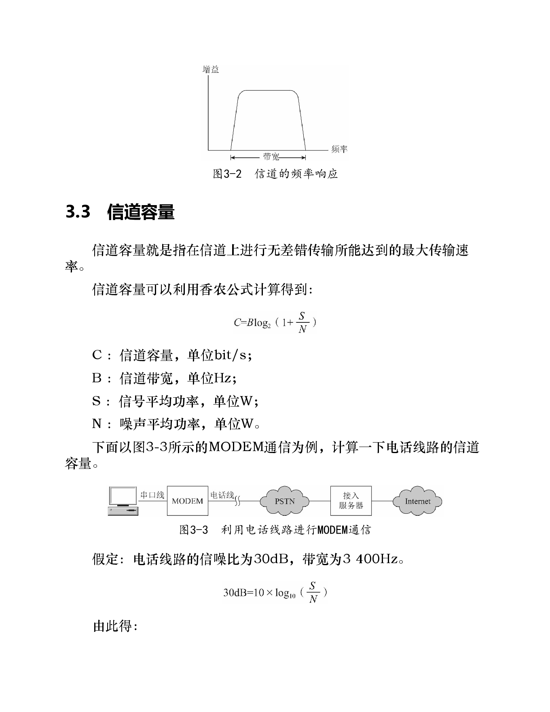
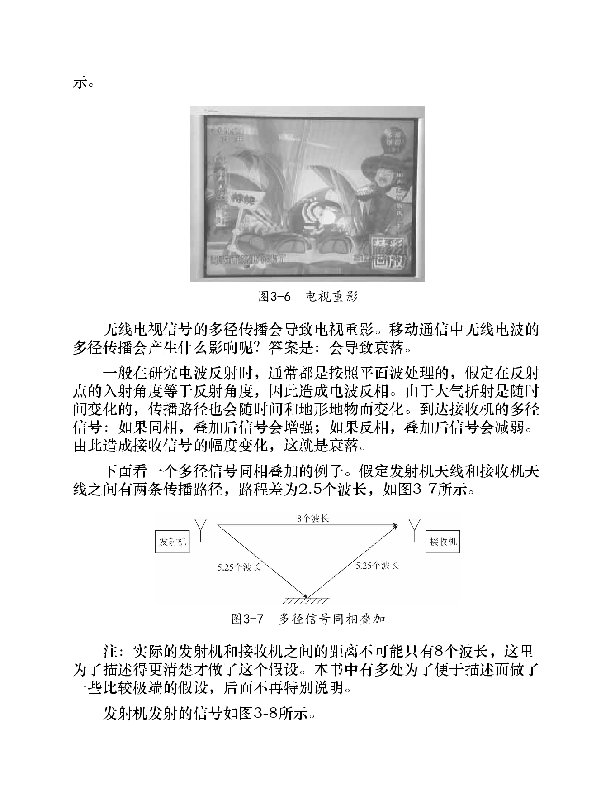
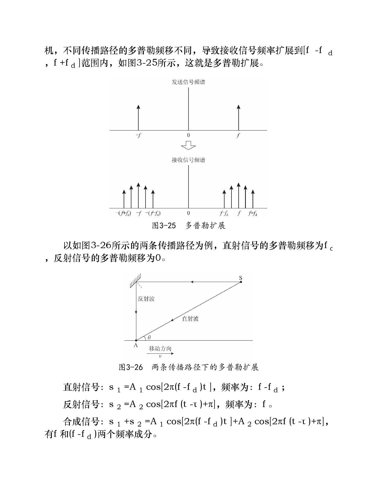

# 第3章 信道

> 本章关键词：[[信道]]、[[噪声]]、[[信道带宽]]、[[信道容量]]、[[香农公式]]、[[路径损耗]]、[[大尺度衰落]]、[[小尺度衰落]]、[[多径效应]]、[[相干带宽]]、[[多普勒频移]]、[[相干时间]]。

## 1. 本章主线

信道是发射机和接收机之间承载信号传播的媒介。理解信道时，可以围绕两个问题：

1. **信道能传多快？** 由信道带宽、噪声和信噪比共同决定，对应[[香农公式]]。
2. **无线信道为什么不稳定？** 由路径损耗、遮挡和多径传播导致，表现为各种衰落。

本章先介绍噪声、带宽和容量，再重点解释移动无线信道中的三类损耗与小尺度衰落。

## 2. 噪声和干扰

信道中除了目标信号，还会混入噪声和干扰，例如：

- 接收机内部热噪声；
- 天线接收到的自然噪声；
- 人为噪声和外部干扰。

这些非目标成分会使接收信号失真，严重时导致误码。因此通信系统不只关心信号功率，也关心信号相对噪声的强弱，即[[信噪比]]。

## 3. 信道带宽

不是所有频率的信号都能等效通过信道。信道的频率响应决定了：

- 哪些频率成分可以通过；
- 哪些频率成分会被削弱甚至滤除。

**信道带宽**就是信道允许通过的频率范围大小。实际信道的带宽总是有限的，所以发送信号的带宽不能超过信道带宽，否则会产生失真。

## 4. 信道容量与香农公式

### 4.1 概念

**信道容量**：在给定信道条件下，能够实现无差错传输的最大信息传输速率。

香农公式：

$$
C = B\log_2\left(1+\frac{S}{N}\right)
$$

其中：

| 符号 | 含义 | 单位 |
|---|---|---|
| $C$ | 信道容量 | bit/s |
| $B$ | 信道带宽 | Hz |
| $S$ | 信号平均功率 | W |
| $N$ | 噪声平均功率 | W |
| $S/N$ | 线性信噪比 | 无单位 |

> 图片转写：原截图中的“信道容量可以利用香农公式计算得到”即上式，并列出 $C,B,S,N$ 的含义。

### 4.2 dB 与线性信噪比的转换

工程中常用 dB 表示信噪比：

$$
\mathrm{SNR}_{\mathrm{dB}} = 10\log_{10}\left(\frac{S}{N}\right)
$$

反过来：

$$
\frac{S}{N}=10^{\mathrm{SNR}_{\mathrm{dB}}/10}
$$

例如：

$$
30\mathrm{dB}\Rightarrow \frac{S}{N}=10^{30/10}=10^3=1000
$$

### 4.3 电话线 MODEM 例子

假设电话线路：

- 信噪比：$30\mathrm{dB}$；
- 带宽：$3400\mathrm{Hz}$。

先将 $30\mathrm{dB}$ 还原为线性信噪比 $1000$，再代入香农公式：

$$
C=3400\times \log_2(1+1000)\approx 33.9\mathrm{kbit/s}
$$

这解释了早期 V.34 MODEM 最高约 $33.6\mathrm{kbit/s}$ 的速率已经接近电话线路容量。

## 5. 移动衰落信道

无线电波传播时会受到建筑物、树木、地形起伏等影响，发生吸收、反射、散射和绕射。接收信号通常比发射信号弱很多。

无线传播损耗可分为三类：

| 类型 | 主要原因 | 影响尺度 | 含义 |
|---|---|---|---|
| 路径损耗 | 自由空间传播扩散 | 大范围距离 | 接收电平随距离增加而平均下降 |
| 大尺度衰落 / 阴影衰落 | 建筑物、山丘等遮挡 | 几百倍波长量级 | 局部区域平均电平起伏 |
| 小尺度衰落 / 多径衰落 | 多径传播 | 几十倍波长量级 | 很小位置变化也可能导致幅度快速起伏 |

## 6. 多径效应与小尺度衰落

### 6.1 什么是多径

**多径**：无线电波从发射天线经过多条传播路径到达接收天线的现象。

典型来源：

- 大气散射；
- 电离层反射和折射；
- 山峦、建筑物等地表物体反射。

接收机收到的信号通常是直达波和多个反射波的叠加。

### 6.2 多径为什么导致衰落

多径信号叠加时，取决于到达接收机时的相位关系：

- **同相叠加**：信号增强；
- **反相叠加**：信号减弱，极端情况下相互抵消。

因此，移动通信中的接收信号幅度会随着位置、时间和频率变化而波动，这就是衰落。

### 6.3 两径模型的直观理解

假设接收端有直射信号和一条反射信号：

$$
s_1=A_1\cos(2\pi ft)
$$

$$
s_2=A_2\cos[2\pi f(t-\tau)+\pi]
$$

合成信号为：

$$
s=s_1+s_2
$$

其中：

- $A_1$：直射信号幅度；
- $A_2$：反射信号幅度；
- $\tau$：反射信号相对直射信号的时延；
- $+\pi$：反射可能带来的反相。

从旋转向量角度看，接收信号幅度等于多个相量合成后的长度。不同频率下相位差不同，因此合成幅度会随频率起伏。

## 7. 相干带宽、频率选择性衰落和平坦衰落

### 7.1 相干带宽

**相干带宽**通常定义为多径信道最大时延 $\tau_m$ 的倒数：

$$
B_c=\frac{1}{\tau_m}
$$

> 图片转写：原截图中将多径信道最大时延 $\tau_m$ 的倒数定义为相干带宽，即 $B_c=1/\tau_m$。

直观理解：相干带宽表示“信道在多宽的频率范围内变化不大”。

### 7.2 频率选择性衰落

如果信号带宽远大于信道相干带宽：

$$
B\gg B_c
$$

则信号中不同频率成分经历的信道增益差别很大，接收后波形容易失真，这种衰落称为**频率选择性衰落**。

> 图片转写：原截图说明，一般信号具有一定带宽；当信号带宽远大于相干带宽时，不同频率成分经多径传播后的幅度增益差别很大。

### 7.3 平坦衰落

如果信号带宽小于信道相干带宽：

$$
B<B_c
$$

则信号中不同频率成分的增益差别不大，整体像是被统一放大或缩小，这种衰落称为**平坦衰落**。

> 图片转写：原截图说明，为避免严重失真，通常希望信号带宽 $B$ 小于相干带宽 $B_c$。

### 7.4 对比总结

| 条件 | 衰落类型 | 影响 |
|---|---|---|
| $B\gg B_c$ | 频率选择性衰落 | 不同频率成分衰落不同，波形失真严重 |
| $B<B_c$ | 平坦衰落 | 各频率成分衰落近似一致，波形失真较小 |

## 8. 多普勒效应、多普勒频移与多普勒扩展

### 8.1 多普勒效应

当波源与观察者之间存在相对运动时，观察者接收到的频率会不同于波源发出的频率。电磁波同样存在多普勒效应：

- 移动台向基站移动：接收频率升高；
- 移动台远离基站：接收频率降低。

### 8.2 多普勒频移

**多普勒频移**：由多普勒效应造成的接收信号频率和发射信号频率之差。

如果移动方向与波源方向在一条直线上：

- 接近波源：

$$
f_d=\frac{v}{\lambda}
$$

- 远离波源：

$$
f_d=-\frac{v}{\lambda}
$$

如果移动方向与波源方向夹角为 $\theta$：

- 接近波源：

$$
f_d=\frac{v\cos\theta}{\lambda}
$$

- 远离波源：

$$
f_d=-\frac{v\cos\theta}{\lambda}
$$

其中：

- $v$：移动速度；
- $\lambda$：波长；
- $\theta$：移动方向与波传播方向的夹角。

#### 高铁例子

高铁速度 $350\mathrm{km/h}$，信号频率 $2.5\mathrm{GHz}$：

$$
\lambda=\frac{3\times10^8}{2.5\times10^9}=0.12\mathrm{m}
$$

$$
f_d=\frac{350\times10^3}{3600\times0.12}\approx810\mathrm{Hz}
$$

### 8.3 多普勒扩展

在多径传播场景下，同一频率 $f$ 的信号会沿不同路径到达接收机。不同路径对应的多普勒频移不同，使接收信号频率从单一频率扩展为一个范围：

$$
[f-f_d,\ f+f_d]
$$

这就是**多普勒扩展**。

> 图片转写：原笔记截图中提到，多径传播下不同传播路径的多普勒频移不同，导致接收信号频率扩展到 $[f-f_d, f+f_d]$ 范围内。

## 9. 相干时间、快衰落与慢衰落

### 9.1 相干时间

**相干时间**通常定义为最大多普勒频移 $f_d$ 的倒数：

$$
T_c=\frac{1}{f_d}
$$

> 图片转写：原截图中将最大多普勒频移 $f_d$ 的倒数 $1/f_d$ 定义为多径信道的相干时间，即 $T_c=1/f_d$。

直观理解：相干时间表示“信道在多长时间内变化不大”。

继续高铁例子，若最大多普勒频移约为 $810\mathrm{Hz}$：

$$
T_c=\frac{1}{810}\approx0.00123\mathrm{s}=1.23\mathrm{ms}
$$

### 9.2 快衰落与慢衰落

设符号持续时间为 $T$：

| 条件 | 衰落类型 | 含义 |
|---|---|---|
| $T\gg T_c$ | 快衰落 | 一个符号持续期间内信道变化很大 |
| $T<T_c$ | 慢衰落 | 一个符号持续期间内信道变化较小 |

为了减少符号内部幅度大幅波动，通常希望符号持续时间小于信道相干时间。

## 10. 横向对比：频域与时域的两个“相干”概念

| 维度 | 关键指标 | 由什么决定 | 判断对象 | 典型结论 |
|---|---|---|---|---|
| 频域 | 相干带宽 $B_c=1/\tau_m$ | 多径最大时延 | 信号带宽 $B$ | $B\gg B_c$ 易频率选择性衰落；$B<B_c$ 近似平坦衰落 |
| 时域 | 相干时间 $T_c=1/f_d$ | 最大多普勒频移 | 符号持续时间 $T$ | $T\gg T_c$ 易快衰落；$T<T_c$ 近似慢衰落 |

记忆方式：

- **时延扩展**导致频率选择性问题，用**相干带宽**衡量；
- **多普勒扩展**导致时间变化问题，用**相干时间**衡量。

## 11. 本章公式汇总

| 公式 | 含义 |
|---|---|
| $C=B\log_2(1+S/N)$ | 香农信道容量 |
| $\mathrm{SNR}_{\mathrm{dB}}=10\log_{10}(S/N)$ | 线性信噪比转 dB |
| $S/N=10^{\mathrm{SNR}_{\mathrm{dB}}/10}$ | dB 转线性信噪比 |
| $B_c=1/\tau_m$ | 相干带宽 |
| $f_d=\pm v/\lambda$ | 直线接近/远离时的多普勒频移 |
| $f_d=\pm v\cos\theta/\lambda$ | 有夹角时的多普勒频移 |
| $T_c=1/f_d$ | 相干时间 |

## 12. 一句话总结

信道容量回答“最多能传多快”，多径和多普勒回答“无线信道为什么会变差、怎样随频率和时间变化”；相干带宽用于判断频率选择性衰落，相干时间用于判断快慢衰落。

## 原书关键图示

