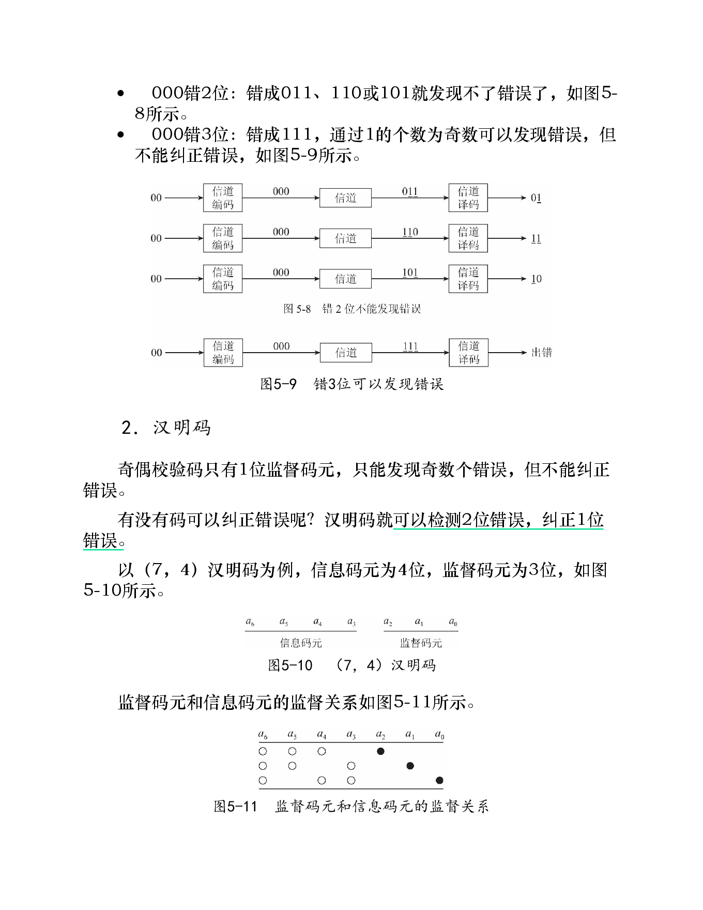
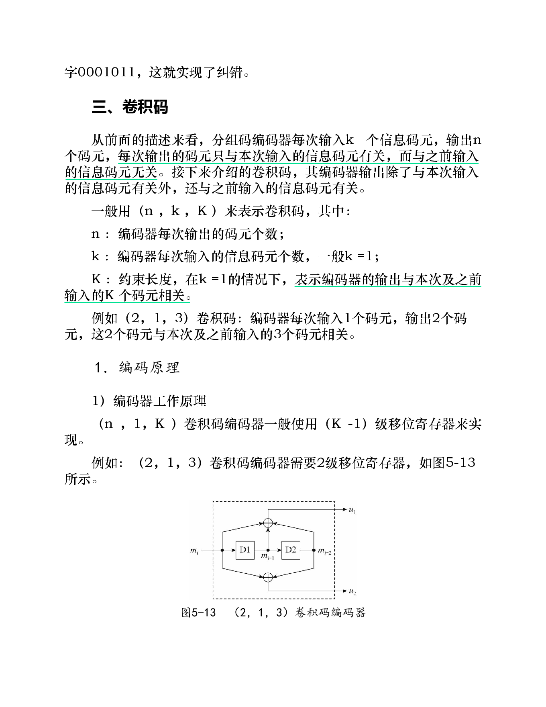
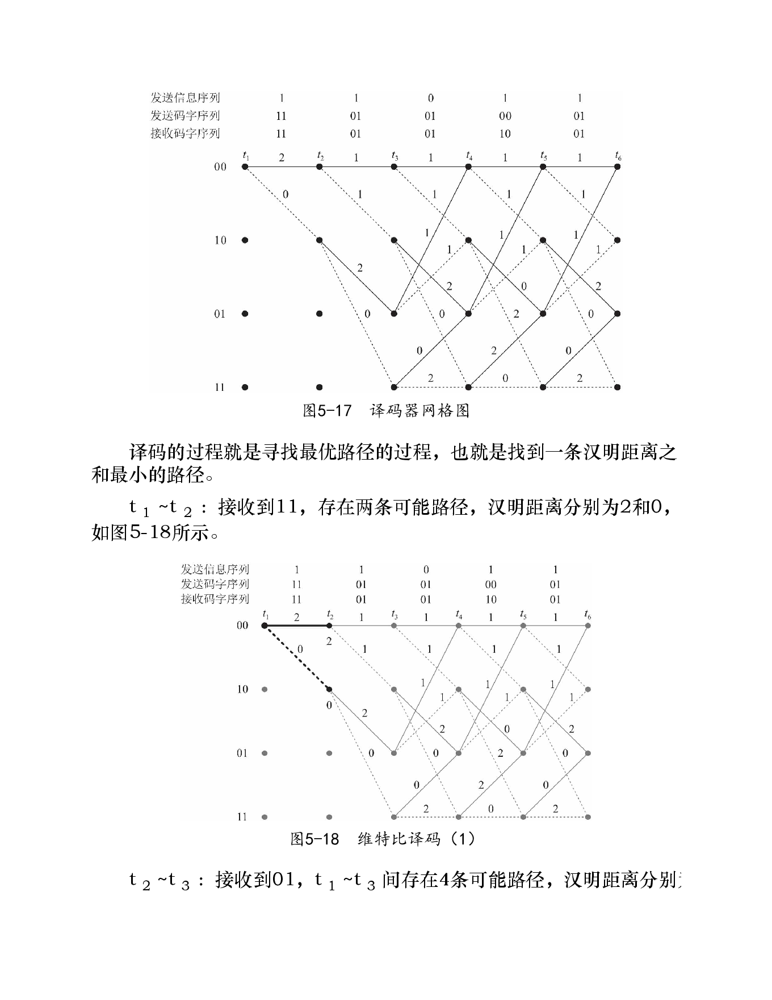
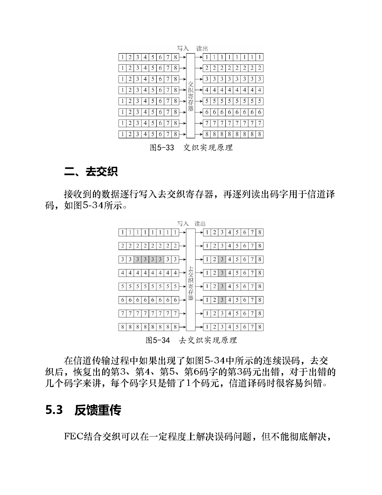
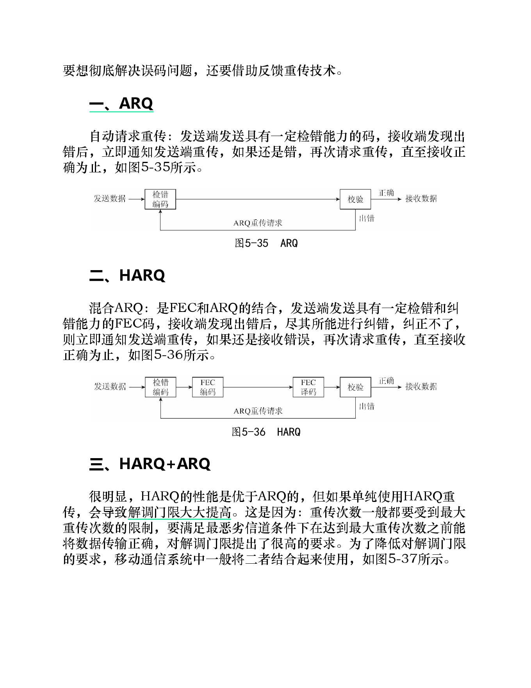

# 第5章 信道编码与交织

> 本章关键词：[[信道编码]]、[[误码]]、[[前向纠错]]、[[后向纠错]]、[[FEC]]、[[重复码]]、[[分组码]]、[[奇偶校验码]]、[[汉明码]]、[[卷积码]]、[[最大似然译码]]、[[维特比译码]]、[[交织]]、[[去交织]]、[[ARQ]]、[[HARQ]]。

## 知识点

### 5.1 FEC
- [ ] 一、重复码
- [ ] 二、分组码
- [ ] 三、卷积码

### 5.2 交织
- [ ] 一、交织
- [ ] 二、去交织

### 5.3 反馈重传
- [ ] 一、ARQ
- [ ] 二、HARQ
- [ ] 三、HARQ + ARQ

---

## 0. 本章总览

信道编码与交织要解决的问题是：**数据经过信道传输后可能出现误码，系统如何发现错误、纠正错误，或通过重传最终得到正确数据。**

解决误码问题主要有两类思路：

| 思路   | 英文 / 缩写 | 核心做法                    | 特点                 |
| ---- | ------- | ----------------------- | ------------------ |
| 后向纠错 | ARQ     | 接收端发现错误后，请求发送端重传        | 冗余较少，但依赖反馈和重传时延    |
| 前向纠错 | FEC     | 发送端主动加入冗余，使接收端可以检错 / 纠错 | 不一定需要重传，但会降低有效传输效率 |

本章的逻辑可以概括为：

```text
误码问题
  ├─ 前向纠错 FEC：重复码、分组码、卷积码
  ├─ 交织：把连续误码打散，变成多个码字中的少量误码
  └─ 反馈重传：ARQ、HARQ、HARQ + ARQ
```

其中：

- **信道编码**：通过增加冗余提高抗误码能力；
- **交织**：不直接纠错，而是改变误码分布，让已有纠错码更容易发挥作用；
- **反馈重传**：当纠错仍然失败时，通过重传保证最终正确性。

---

# 5.1 FEC

FEC 全称是 **Forward Error Correction**，即**前向纠错码**。

它的基本思想是：

> 发送端在原始信息比特之外加入一定冗余信息，使接收端即使收到的比特中存在少量错误，也能根据冗余关系发现错误甚至纠正错误。

FEC 的代价是：发送的数据变多，有效信息传输效率下降；收益是：系统抗误码能力增强。

---

## 一、重复码

### 1. 基本思想

重复码是最简单的信道编码方法：

> 把同一个信息比特重复发送多次，让接收端按照“少数服从多数”的原则判决。

例如采用 3 次重复：

```text
0 → 000    1 → 111
```

接收端判决规则：

| 接收结果 | 判决 |
|---|---|
| 000、001、010、100 | 0 |
| 111、110、101、011 | 1 |

### 2. 纠错能力

3 次重复码可以纠正 1 位错误。

但是如果同一个重复码组中错了 2 位，就会判错。例如：

```text
发送：0 → 000
接收：110
判决：1
```

此时错误位数超过了多数判决可以承受的范围。

### 3. 缺点：传输效率低

重复码的问题是效率很低。

以 3 次重复码为例：1 个信息比特要发送 3 个码元，因此码率为：

$$
R=\frac{1}{3}
$$

也就是说，只有三分之一的数据是真正的信息，其余都是冗余。

所以重复码直观、容易理解，但在实际系统中通常不是最优选择。

---

## 二、分组码

### 1. 分组码的基本形式

为了提高效率，可以把 $k$ 位信息比特作为一组，只增加少量冗余码元，形成 $n$ 位码字，这就是**分组码**。

一般记为：

$$
(n,k)\text{ 分组码}
$$

其中：

| 符号 | 含义 |
|---|---|
| $k$ | 信息码元个数 |
| $n$ | 编码后码字长度 |
| $n-k$ | 监督码元 / 校验码元个数 |

分组码的码率为：

$$
R=\frac{k}{n}
$$

分组码中增加的 $(n-k)$ 位冗余码元称为**监督码元**或**校验码元**，用于检错和纠错。

需要注意：分组码的监督码元通常只监督本码组中的 $k$ 个信息比特。

---

### 2. 奇偶校验码

#### 2.1 基本思想

最简单的分组码是**奇偶校验码**，它只增加 1 位监督码元。

以 $(3,2)$ 偶校验码为例：给 2 位信息比特增加 1 位校验位，使整个码字中 `1` 的个数为偶数。

```text
00 → 000
01 → 011
10 → 101
11 → 110
```

偶校验的规则是：

> 对收到码字的所有位做异或，如果结果为 0，则认为没有检测到错误；如果结果为 1，则认为发生错误。（同号为 0，异号为 1）

#### 2.2 检错能力

奇偶校验码可以检测出**奇数个错误**。

#### 2.3 不能纠错

奇偶校验码虽然可以发现某些错误，但不能确定是哪一位错了。

例如接收到 `001`，它可能来自：

```text
000 的第 3 位出错
011 的第 2 位出错
101 的第 1 位出错
```

由于无法判断真实发送码字是哪一个，所以奇偶校验码**不能纠错**。

---

### 3. 汉明码

奇偶校验码只有 1 位监督码元，只能发现奇数个错误，不能纠错。

**汉明码**通过设计多组校验关系，使接收端不仅能发现错误，还能定位错误位置。

书中以 $(7,4)$ 汉明码为例：

| 类型 | 数量 |
|---|---|
| 信息码元 | 4 位 |
| 监督码元 | 3 位 |
| 码字总长 | 7 位 |

$(7,4)$ 汉明码可以：

- 检测 2 位错误；
- 纠正 1 位错误。

#### 3.1 码元关系

设 7 位码字为：

```text
a6 a5 a4 a3 a2 a1 a0
```

其中 $a_6,a_5,a_4,a_3$ 是信息码元，$a_2,a_1,a_0$ 是监督码元。

书中给出的偶校验关系为：

$$
a_6 \oplus a_5 \oplus a_4 \oplus a_2 = 0
$$

$$
a_6 \oplus a_5 \oplus a_3 \oplus a_1 = 0
$$

$$
a_6 \oplus a_4 \oplus a_3 \oplus a_0 = 0
$$

其中 $\oplus$ 表示异或。

也就是说：

| 监督码元 | 监督的信息码元 |
|---|---|
| $a_2$ | $a_6,a_5,a_4$ |
| $a_1$ | $a_6,a_5,a_3$ |
| $a_0$ | $a_6,a_4,a_3$ |

#### 3.2 伴随式 / 校验结果

接收端分别对三组校验关系做异或，得到：

$$
s_2=a_6\oplus a_5\oplus a_4\oplus a_2
$$

$$
s_1=a_6\oplus a_5\oplus a_3\oplus a_1
$$

$$
s_0=a_6\oplus a_4\oplus a_3\oplus a_0
$$

把 $s_2s_1s_0$ 合在一起，就可以判断错误位置。

| $s_2s_1s_0$ | 含义 |
|---|---|
| 000 | 没有检测到错误 |
| 111 | $a_6$ 出错 |
| 110 | $a_5$ 出错 |
| 101 | $a_4$ 出错 |
| 011 | $a_3$ 出错 |
| 100 | $a_2$ 出错 |
| 010 | $a_1$ 出错 |
| 001 | $a_0$ 出错 |

这就是汉明码可以纠错的关键：

> 不同位置的单比特错误会产生不同的校验结果，因此可以定位错误位。

#### 3.3 纠错方法

一旦判断出哪一位出错，只需要把该位取反：

```text
0 → 1
1 → 0
```

例如收到码字 `0101011`，如果计算得：

```text
s2s1s0 = 110
```

根据表格可知 $a_5$ 出错，接收端把 $a_5$ 取反即可恢复正确码字。

---

## 三、卷积码

### 1. 分组码与卷积码的区别

分组码的特点是：

> 每次输出的码字只与当前输入的 $k$ 个信息码元有关，与之前输入无关。

卷积码不同：

> 卷积码编码器的输出不仅与当前输入有关，还与之前输入的信息码元有关。

因此卷积码具有“记忆”。这种记忆通常由移位寄存器实现。

### 2. 卷积码的表示

卷积码一般记为：

$$
(n,k,K)
$$

其中：

| 符号 | 含义 |
|---|---|
| $n$ | 编码器每次输出的码元个数 |
| $k$ | 编码器每次输入的信息码元个数，常见情况为 $k=1$ |
| $K$ | 约束长度；当 $k=1$ 时，表示输出与本次及之前共 $K$ 个输入码元相关 |

例如 $(2,1,3)$ 卷积码表示：

- 每次输入 1 个码元；
- 每次输出 2 个码元；
- 输出与当前输入和之前 2 个输入有关，即共 3 个输入码元相关。

---

### 3. 卷积码编码原理

#### 3.1 移位寄存器实现

$(n,1,K)$ 卷积码编码器通常使用 $(K-1)$ 级移位寄存器实现。

以 $(2,1,3)$ 卷积码为例，需要 2 级移位寄存器。

设当前输入为 $m_i$，前两个输入分别为 $m_{i-1}$、$m_{i-2}$，编码器输出为 $u_1,u_2$。

书中给出的输出关系为：

$$
u_1=m_i\oplus m_{i-1}\oplus m_{i-2}
$$

$$
u_2=m_i\oplus m_{i-2}
$$

如果移位寄存器初始状态为 `00`，输入序列为：

```text
11011
```

则编码输出为：

```text
11 01 01 00 01
```

#### 3.2 网格图

卷积码编码器有记忆，因此可以用**网格图**描述状态转移。

对于 $(2,1,3)$ 卷积码，两个寄存器共有 4 种状态：

```text
00、10、01、11
```

网格图的含义：

| 元素 | 含义 |
|---|---|
| 横轴 | 时间 |
| 纵轴 | 寄存器状态 |
| 实线 | 输入 0 |
| 虚线 | 输入 1 |
| 分支旁数字 | 对应输出码元 |

编码过程就是：从初始状态出发，根据输入比特沿网格图移动，并读出每条分支对应的输出码元。

---

### 4. 卷积码译码原理

卷积码译码一般采用**最大似然译码**思想，实际中常用**维特比译码算法**降低复杂度。

#### 4.1 最大似然译码

最大似然译码的思想是：

> 在所有可能的发送序列中，找出最有可能导致当前接收序列的那一个，把它作为译码结果。

假设信道误码率为 $P_e$，并且 $P_e<0.5$。

如果信息序列长度为 $L$，则可能的信息序列共有：

$$
2^L
$$

种。每一种信息序列都会对应一个可能的编码输出序列。

接收端收到码字序列 $B$ 后，可以遍历所有可能发送码字序列 $A_i$，计算其与 $B$ 的差异。

因为 $P_e<0.5$，错误码元越少的发送序列发生概率越高。所以最大似然译码等价于：

> 找到与接收码字序列汉明距离之和最小的发送码字序列。

**汉明距离**：两个等长码字对应位不同的个数。

例如：

| 码字 1 | 码字 2 | 汉明距离 |
|---|---|---|
| 01 | 10 | 2 |
| 00 | 01 | 1 |

最大似然译码的问题是：需要遍历 $2^L$ 种可能，计算量随 $L$ 指数增长，难以直接实现。

#### 4.2 维特比译码

维特比译码是最大似然译码的一种高效实现。

它利用卷积码的网格结构，在每个状态只保留当前距离最小的路径，丢弃较差路径，从而避免遍历所有完整序列。

译码器网格图与编码器网格图类似，不同之处是：

| 编码器网格图 | 译码器网格图 |
|---|---|
| 分支旁数字表示编码输出 | 分支旁数字表示接收码字与该分支应输出码字之间的汉明距离 |

维特比译码过程可以理解为：

1. 根据接收到的码字序列，在网格图中计算每条分支的汉明距离；
2. 对到达同一状态的多条路径，保留累计汉明距离最小的路径；
3. 随时间推进，不断剪枝；
4. 最后选出累计汉明距离最小的完整路径；
5. 根据该路径反推出输入信息序列。

书中例子：接收码字为：

```text
11 01 01 10 01
```

相对于正确编码序列：

```text
11 01 01 00 01
```

只有 1 个码元出错。通过维特比译码，在网格图中寻找累计汉明距离最小路径，最终恢复出的信息序列为：

```text
11011
```

### 5. 卷积码的应用

移动通信系统中曾大量使用卷积码。例如书中列举：

| 系统 | 卷积码示例 |
|---|---|
| CDMA2000 | $(2,1,9)$、$(3,1,9)$、$(4,1,9)$ |
| WCDMA | $(2,1,9)$、$(3,1,9)$ |
| LTE 控制信道 | $(3,1,7)$ |

这些例子说明卷积码在无线通信系统中具有重要应用，尤其适合处理信道误码问题。

---

# 5.2 交织

FEC 可以纠错，但很多纠错码更擅长处理**随机分散的少量错误**，不擅长处理**连续突发错误**。

交织的作用是：

> 把信道中的连续误码打散，使其在去交织后分散到不同码字中，从而降低每个码字内部的错误数量，便于信道译码纠错。

交织本身不增加纠错能力，也不直接修改数据，它只是改变数据的排列顺序。

---

## 一、交织

交织通常通过交织寄存器实现。

发送端的做法是：

```text
按行写入 → 按列读出 → 发送
```

也就是说，信道编码后的码字先逐行写入交织寄存器，然后逐列读出并发送。

这样原本相邻的码元在发送序列中被分散开。

如果信道出现一段连续误码，这段连续错误落在交织后的发送序列中；经过接收端去交织后，它们会被重新分散到不同码字的不同位置。

---

## 二、去交织

接收端执行相反过程：

```text
接收数据 → 按行写入去交织寄存器 → 按列读出 → 送入信道译码器
```

去交织的效果是：把信道中的连续误码变成多个码字中的分散误码。

例如，传输过程中出现连续误码。去交织后，可能变成：

```text
第 3 个码字错 1 位
第 4 个码字错 1 位
第 5 个码字错 1 位
第 6 个码字错 1 位
```

对于每个码字来说，只错了 1 位，信道译码器就容易纠正。

因此，交织经常与 FEC 配合使用：

```text
信道编码 → 交织 → 信道传输 → 去交织 → 信道译码
```

### 交织的关键理解

| 问题 | 解释 |
|---|---|
| 交织是否能纠错？ | 不能，真正纠错的是后面的信道译码 |
| 交织的作用是什么？ | 改变错误分布，把连续错误打散 |
| 为什么要交织？ | 因为很多纠错码对分散错误更有效，对突发错误较弱 |
| 代价是什么？ | 引入一定缓存和时延 |

---

# 5.3 反馈重传

FEC 和交织可以在一定程度上降低误码，但不能彻底消除误码。

如果希望最终接收数据完全正确，还需要反馈重传机制。

---

## 一、ARQ

ARQ 全称是 **Automatic Repeat reQuest**，即**自动请求重传**。

基本流程：

1. 发送端发送具有检错能力的数据；
2. 接收端检查是否出错；
3. 如果正确，接收端确认接收；
4. 如果错误，接收端通知发送端重传；
5. 若重传仍错误，则继续请求重传，直到正确为止。

可以概括为：

```text
发送 → 检错 → 错误则请求重传 → 直到正确
```

ARQ 的特点：

| 优点 | 缺点 |
|---|---|
| 可以通过重传提高可靠性 | 需要反馈信道 |
| 不需要很强的前向纠错能力 | 会增加时延 |
| 冗余可相对较少 | 信道很差时重传次数可能很多 |

---

## 二、HARQ

HARQ 全称是 **Hybrid ARQ**，即**混合 ARQ**。

它是 FEC 和 ARQ 的结合：

> 发送端先发送具有检错和纠错能力的 FEC 码；接收端收到后尽量纠错；如果纠错失败，再请求重传。

流程为：

```text
发送 FEC 码 → 接收端尝试纠错 → 纠错失败则请求重传 → 直到正确
```

HARQ 比普通 ARQ 更高效，因为很多错误可以在接收端直接由 FEC 纠正，不一定需要重传。

### ARQ 与 HARQ 对比

| 项目 | ARQ | HARQ |
|---|---|---|
| 是否使用 FEC | 可以只依赖检错 | 使用 FEC |
| 接收端能否主动纠错 | 通常不能或较弱 | 可以先尝试纠错 |
| 出错后的处理 | 请求重传 | 先纠错，纠不了再重传 |
| 性能 | 较低 | 较高 |
| 复杂度 | 较低 | 较高 |

---

## 三、HARQ + ARQ

书中指出：HARQ 的性能优于 ARQ，但如果单纯依赖 HARQ 重传，会导致解调门限大大提高。

原因是：

- 重传次数通常有最大限制；
- 如果要求在最恶劣信道条件下，必须在最大重传次数内传输正确；
- 系统就必须把解调要求设计得很严格；
- 这会提高解调门限，影响系统设计和覆盖能力。

因此，移动通信系统中常把 HARQ 和 ARQ 结合起来：

```text
HARQ 先处理大部分误码
ARQ 再处理 HARQ 后残留的少量误码
```

这种设计思想是：

> 利用 HARQ 将误码控制在一定水平，再把残留误码交给 ARQ 重传，从整体上取得更好的系统性能。

### 三种方式的层次关系

| 机制 | 解决层次 | 作用 |
|---|---|---|
| FEC | 物理层纠错 | 通过冗余直接纠错 |
| HARQ | FEC + 快速重传 | 纠错失败后快速重传 |
| ARQ | 更高层可靠传输 | 处理残留错误，保证最终可靠性 |

---

## 4. 本章小结

本章围绕“信道误码如何处理”展开。

### 4.1 核心概念

| 概念 | 一句话理解 |
|---|---|
| FEC | 发送端加冗余，接收端前向纠错 |
| 重复码 | 同一比特重复发送，按多数判决 |
| 分组码 | $k$ 位信息加 $n-k$ 位校验，形成 $n$ 位码字 |
| 奇偶校验码 | 能检测奇数个错误，不能纠错 |
| 汉明码 | 通过多组校验定位单比特错误 |
| 卷积码 | 输出与当前和过去输入有关，有记忆 |
| 最大似然译码 | 找最可能的发送序列 |
| 维特比译码 | 在网格图中找累计距离最小路径 |
| 交织 | 把连续误码打散，帮助 FEC 纠错 |
| ARQ | 出错后请求重传 |
| HARQ | FEC 与 ARQ 的结合 |

### 4.2 易混点

| 易混点 | 区分 |
|---|---|
| 信源编码 vs 信道编码 | 信源编码减少冗余、压缩码率；信道编码增加冗余、提高可靠性 |
| 检错 vs 纠错 | 检错只知道有错；纠错还能恢复正确数据 |
| 奇偶校验码 vs 汉明码 | 奇偶校验码能检错但不能纠错；汉明码可以定位并纠正单比特错误 |
| 分组码 vs 卷积码 | 分组码当前码字只与当前分组有关；卷积码输出与历史输入有关 |
| 交织 vs FEC | 交织不纠错，只改变错误分布；FEC 才负责纠错 |
| ARQ vs HARQ | ARQ 主要靠重传；HARQ 先用 FEC 纠错，失败后再重传 |

### 4.3 记忆线索

```text
信道有误码
  → 先靠 FEC 加冗余纠错
  → 遇到突发错误，用交织把错误打散
  → 还纠不了，就靠 ARQ / HARQ 重传
```

对于无线通信系统，尤其是移动通信和 RFID 等系统，信道环境往往不稳定，误码不可避免。因此，信道编码、交织和反馈重传是保证通信可靠性的基础技术。

## 原书关键图示










