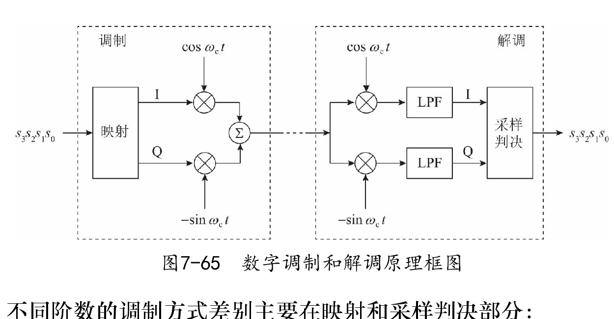
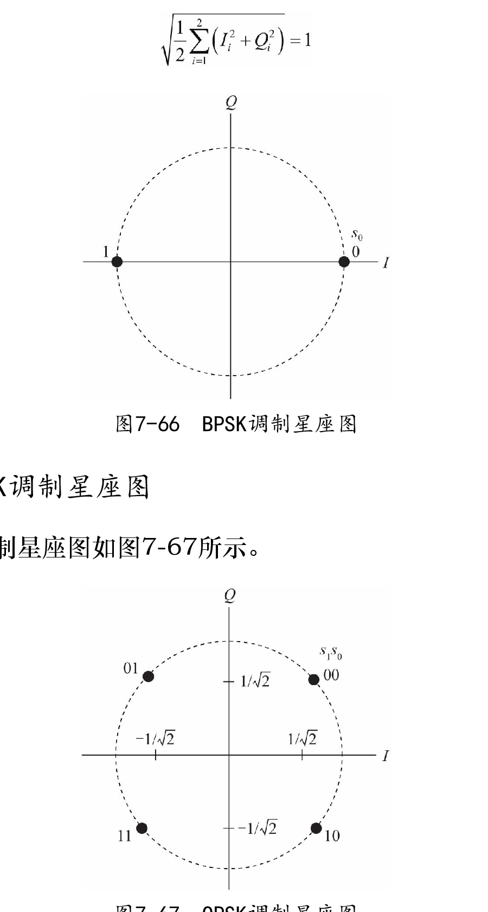
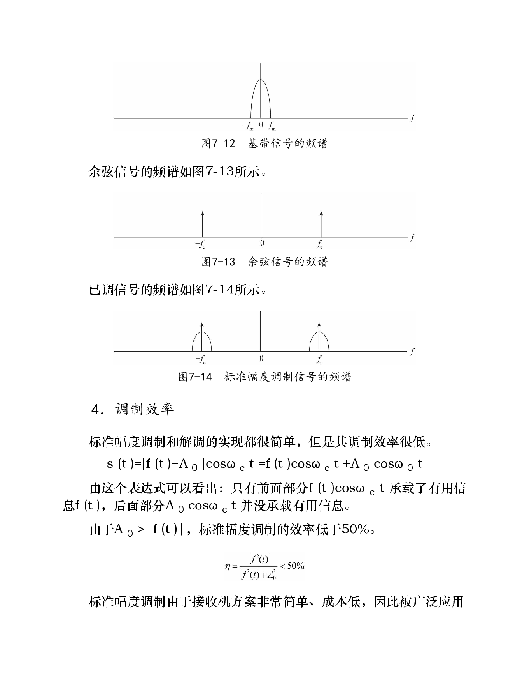
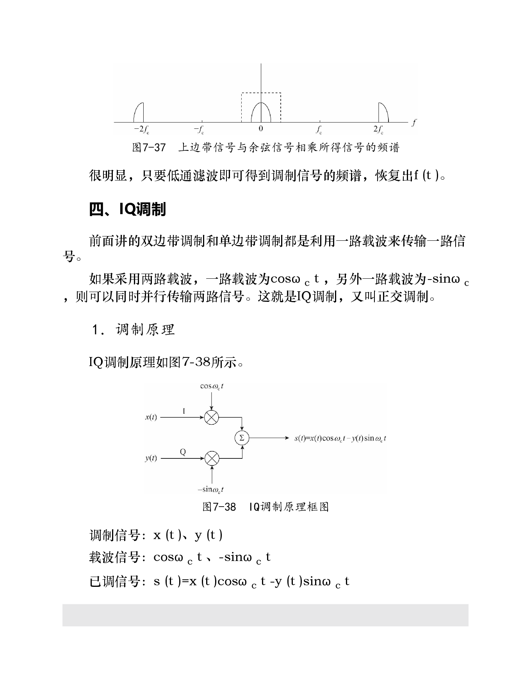
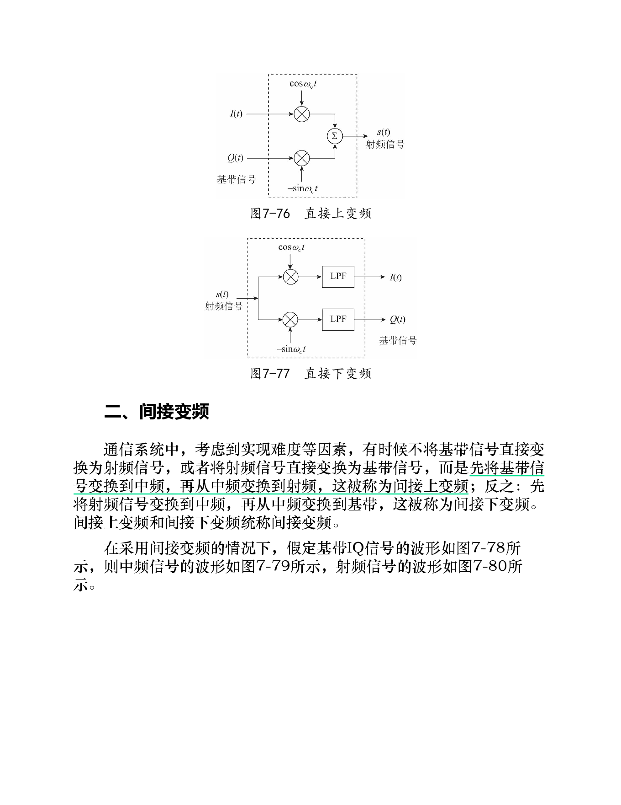
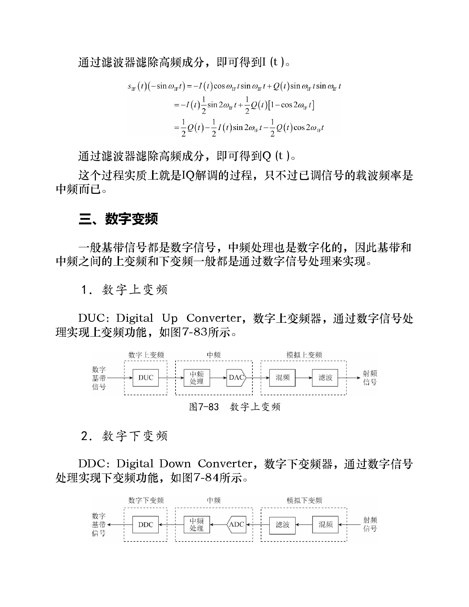
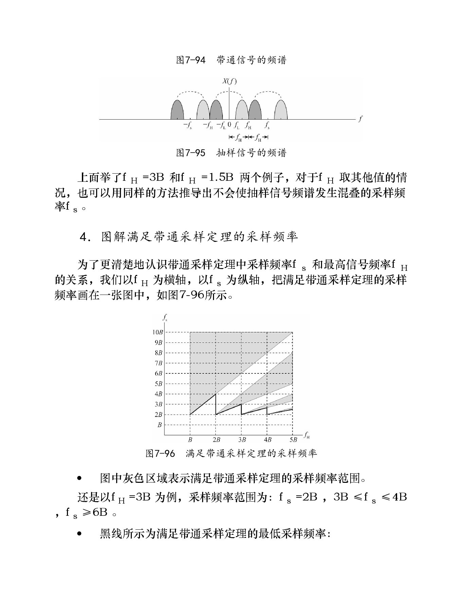

# 第7章 频带信号的发送和接收

> 本章关键词：[[频带信号]]、[[基带信号]]、[[调制]]、[[解调]]、[[载波]]、[[幅度调制]]、[[双边带调制]]、[[单边带调制]]、[[IQ 调制]]、[[数字调制]]、[[PSK]]、[[QAM]]、[[星座图]]、[[格雷码]]、[[调制效率]]、[[波特率]]、[[直接变频]]、[[间接变频]]、[[数字变频]]、[[带通采样]]。

## 知识点

### 7.1 模拟调制
- [ ] 一、标准幅度调制
- [ ] 二、双边带调制
- [ ] 三、单边带调制
- [ ] 四、IQ 调制

### 7.2 数字调制
- [ ] 一、数字调制
- [ ] 二、PSK 调制
- [ ] 三、QAM 调制
- [ ] 四、数字调制的实现
- [ ] 五、星座图
- [ ] 六、数字调制的映射关系
- [ ] 七、调制效率

### 7.3 变频技术
- [ ] 一、直接变频
- [ ] 二、间接变频
- [ ] 三、数字变频
- [ ] 四、带通采样

---

## 0. 本章总览

本章讨论的是：**如何把基带信号搬移到高频载波上形成频带信号，以及接收端如何把频带信号恢复为基带信号。**

基本思路是调制：

> 发送端产生高频载波，让载波的幅度、频率或相位随着调制信号变化；接收端再从载波变化中恢复原始信号。

按调制信号类型，可分为：

| 类型 | 调制对象 | 例子 |
|---|---|---|
| 模拟调制 | 模拟信号 | 标准幅度调制、双边带、单边带、IQ 调制 |
| 数字调制 | 数字比特 | BPSK、QPSK、8PSK、16QAM |

本章结构：

```text
频带信号的发送和接收
  ├─ 模拟调制：AM、DSB、SSB、IQ
  ├─ 数字调制：PSK、QAM、星座图、格雷码、调制效率
  └─ 变频技术：直接变频、间接变频、数字变频、带通采样
```

---

# 7.1 模拟调制

模拟调制是指调制信号为模拟信号。

常见模拟调制有三类：

| 调制方式 | 控制载波的参数 | 俗称 |
|---|---|---|
| 幅度调制 | 幅度 | 调幅 |
| 频率调制 | 频率 | 调频 |
| 相位调制 | 相位 | 调相 |

书中重点讲幅度调制及其扩展。

---

## 一、标准幅度调制

### 1. 基本思想

标准幅度调制的思想是：

> 用低频电信号控制高频载波的幅度，使高频载波包络随低频信号变化。

接收端只要提取高频信号的包络，就可以恢复低频信号。

### 2. 为什么要抬高电平

如果直接把一个幅度在正负之间变化的低频信号 $f(t)$ 与载波相乘，载波幅度不会按照预期包络变化，容易出现**相位反转和包络失真**。

解决方法是：给低频信号加一个直流偏置 $A_0$，使：

$$
f(t)+A_0>0
$$

也就是要求：

$$
A_0>|f(t)|
$$

这样得到的标准调幅信号为：

$$
s(t)=[f(t)+A_0]\cos \omega_c t
$$

其中：

| 符号 | 含义 |
|---|---|
| $f(t)$ | 调制信号 / 低频信号 |
| $\cos\omega_c t$ | 高频载波 |
| $A_0$ | 直流偏置 |
| $s(t)$ | 已调信号 |

### 3. 解调原理

标准幅度调制可以用简单的包络检波解调。

书中的实现思路是：

1. 利用二极管单向导通性进行整流；
2. 利用电容高频旁路特性进行低通滤波，得到包络；
3. 利用电容隔直特性去掉直流分量，把信号搬回零电平附近。

这就是无线电广播中常见的简单接收机思路。

### 4. 频谱与调制效率

标准调幅信号可展开为：

$$
s(t)=[f(t)+A_0]\cos\omega_c t
=f(t)\cos\omega_c t+A_0\cos\omega_c t
$$

其中：

| 项 | 是否承载信息 |
|---|---|
| $f(t)\cos\omega_c t$ | 承载有用信息 |
| $A_0\cos\omega_c t$ | 空载波，不承载信息 |

因为 $A_0>|f(t)|$，空载波消耗了大量功率，导致标准幅度调制效率低于 50%。

标准幅度调制优点是接收机简单、成本低，所以适合广播；缺点是效率低，不适合很多双向无线通信系统。

---

## 二、双边带调制

标准幅度调制效率低，是因为发送了不携带信息的空载波。

双边带调制去掉直流偏置，直接发送：

$$
s(t)=f(t)\cos\omega_c t
$$

### 1. 调制原理

双边带调制就是把调制信号与载波相乘。

| 信号 | 表达式 |
|---|---|
| 调制信号 | $f(t)$ |
| 载波 | $\cos\omega_c t$ |
| 已调信号 | $f(t)\cos\omega_c t$ |

它不发送空载波，所以功率效率高于标准调幅。

### 2. 解调原理：相干解调

双边带调制不能用普通包络检波，否则会严重失真。

原因是：双边带信号的包络不再简单等于原始调制信号。

双边带调制需要**相干解调**：

1. 接收端产生与发送载波同频同相的本地载波；
2. 将接收信号与本地载波相乘；
3. 通过低通滤波器滤除高频分量；
4. 恢复 $f(t)$。

可概括为：

```text
接收信号 × 同频同相本地载波 → 低通滤波 → 原始信号
```

### 3. 上边带与下边带

双边带调制会把基带频谱搬移到载波频率附近，形成两个边带：

| 边带 | 含义 |
|---|---|
| 上边带 USB | 频率高于载波频率的部分 |
| 下边带 LSB | 频率低于载波频率的部分 |

双边带信号的上边带和下边带都来源于基带信号频谱，二者都携带完整信息。

这就引出了单边带调制：既然两个边带信息重复，是否只发送一个即可？

---

## 三、单边带调制

### 1. 基本思想

单边带调制是：

> 在双边带调制的基础上，只保留上边带或下边带中的一个进行发送。

这样可以节省一半带宽。

| 类型 | 实现方式 |
|---|---|
| 下边带调制 LSB | 用低通滤波器截取下边带 |
| 上边带调制 USB | 用高通滤波器截取上边带 |

### 2. 解调原理

单边带调制也采用相干解调：

```text
单边带信号 × 同频同相本地载波 → 低通滤波 → 原始信号
```

虽然只发送一个边带，但由于单个边带已经携带基带信号全部信息，接收端仍然可以恢复 $f(t)$。

### 3. 优缺点

| 优点 | 缺点 |
|---|---|
| 节省一半带宽 | 滤波器实现要求高 |
| 不发送冗余边带 | 需要相干解调 |
| 功率和频谱利用率更高 | 系统复杂度高于标准调幅 |

---

## 四、IQ 调制

前面的双边带和单边带调制，本质上用一路载波传输一路信号。

IQ 调制使用两路正交载波：

- I 路载波：$\cos\omega_c t$；
- Q 路载波：$-\sin\omega_c t$。

这两路载波正交，因此可以并行传输两路信号。

### 1. 调制原理

设 I 路输入为 $x(t)$，Q 路输入为 $y(t)$，则 IQ 调制输出为：

$$
s(t)=x(t)\cos\omega_c t-y(t)\sin\omega_c t
$$

其中：

| 分量 | 含义 |
|---|---|
| I | In-phase，同相分量 |
| Q | Quadrature，正交分量 |

IQ 调制也称为正交调制，是现代通信系统的核心基础。

### 2. 为什么叫正交调制

可以用旋转向量理解 IQ 调制：

- I 分量对应实轴方向；
- Q 分量对应虚轴方向；
- 两个分量在旋转过程中始终互相垂直；
- 合成向量在实轴上的投影就是实际发送的频带信号。

因为两路载波始终正交，所以 I、Q 两路信号可以在同一载波频率上传输，并在接收端分离。

### 3. 解调原理

IQ 解调的过程是：

| 支路 | 操作 | 结果 |
|---|---|---|
| I 路 | 接收信号乘以 $\cos\omega_c t$，再低通滤波 | 恢复 $x(t)$ |
| Q 路 | 接收信号乘以 $-\sin\omega_c t$，再低通滤波 | 恢复 $y(t)$ |

低通滤波会去掉高频分量，保留对应的基带 I/Q 信号。

---

# 7.2 数字调制

数字调制用于传输数字比特。

基本思想与模拟调制类似：

> 让高频载波的幅度、频率或相位随数字信号变化。

移动通信系统中常见的是：

- PSK：相位变化；
- QAM：幅度和相位都变化。

---

## 一、数字调制

数字调制可以理解为：

> 把若干比特映射为一个码元，每个码元对应一种载波状态。

“载波状态”可以是：

- 不同相位；
- 不同幅度；
- 不同幅度和相位组合。

码元种类越多，每个码元能携带的比特数越多，但星座点之间距离越小，抗干扰能力越弱。

---

## 二、PSK 调制

PSK 是 Phase Shift Keying，即**相移键控**。

它通过改变载波相位来表示数字信息。

### 1. BPSK

BPSK 是二相相移键控。

载波有 2 种相位，分别表示 0 和 1。

可以理解为：

| 比特 | 载波相位 | 信号 |
|---|---|---|
| 0 | 0 | $\cos\omega_c t$ |
| 1 | $\pi$ | $-\cos\omega_c t$ |

每个码元携带 1 个比特。

### 2. QPSK

QPSK 是四相相移键控。

载波有 4 种相位，每个码元表示 2 个比特，例如：

```text
00、01、11、10
```

每个码元携带：

$$
\log_2 4=2
$$

个比特。

### 3. 8PSK

8PSK 使用 8 种载波相位，每个码元表示 3 个比特，例如：

```text
000、001、011、010、110、111、101、100
```

每个码元携带：

$$
\log_2 8=3
$$

个比特。

### 4. PSK 的权衡

PSK 阶数越高，一个码元携带的比特越多，频谱效率越高。

但相位数增加后，相邻相位间隔变小，信号更容易被噪声扰动到相邻判决区域，抗干扰能力下降。

---

## 三、QAM 调制

QAM 是 Quadrature Amplitude Modulation，即**正交幅度调制**。

PSK 只改变相位，不改变幅度。若想进一步提高每个码元携带的比特数，可以让载波的幅度和相位都随输入数据变化，这就是 QAM。

### 1. 16QAM

16QAM 使用 16 种幅度 / 相位组合，每个码元表示 4 个比特。

$$
\log_2 16=4
$$

例如 16 个星座点可分别表示：

```text
0000、0001、0011、0010、...、1001、1000
```

16QAM 的频谱效率高于 QPSK 和 8PSK，但对信道质量要求也更高。

### 2. QAM 的特点

| 特点 | 说明 |
|---|---|
| 同时使用幅度和相位 | 星座点可以分布在不同半径和角度上 |
| 每码元比特数高 | 适合高速传输 |
| 抗干扰能力相对弱 | 星座点间距更小，容易误判 |

---

## 四、数字调制的实现

数字调制在工程上通常通过 IQ 调制实现。

基本流程：

```text
输入比特 → 映射为 I/Q 数据 → IQ 调制 → 频带信号
频带信号 → IQ 解调 → I/Q 采样判决 → 输出比特
```



*映射把比特变为 I/Q 码元；正交载波完成上、下变频；接收端经低通、采样和判决恢复比特。*

### 1. BPSK 的实现

BPSK 中：

- 0 对应 $\cos\omega_c t$；
- 1 对应 $-\cos\omega_c t$。

因此可以先把比特映射为 I 路电平：

| 比特 | I 路电平 | Q 路 |
|---|---|---|
| 0 | +1 | 0 |
| 1 | -1 | 0 |

再通过幅度调制 / IQ 调制实现。

接收端低通滤波后，对 I 路电平采样判决即可恢复比特。

### 2. QPSK 的实现

QPSK 每 2 个比特映射为一对 I/Q 数据。

发送端：

```text
2 个比特 → 1 对 I/Q 值 → IQ 调制
```

接收端：

```text
IQ 解调 → 每个码元采样得到 1 对 I/Q 值 → 判决为 2 个比特
```

### 3. 8PSK 的实现

8PSK 每 3 个比特映射为一对 I/Q 数据。

发送端：

```text
3 个比特 → 1 对 I/Q 值 → IQ 调制
```

接收端采样判决后恢复 3 个比特。

### 4. 16QAM 的实现

16QAM 每 4 个比特映射为一对 I/Q 数据。

发送端：

```text
4 个比特 → 1 对 I/Q 值 → IQ 调制
```

接收端通过 IQ 解调和采样判决恢复 4 个比特。

### 5. 总结

不同数字调制方式的差别主要体现在映射和判决部分。

| 调制方式 | 调制时映射 | 解调时判决 |
|---|---|---|
| BPSK | 1 比特 → 1 个 I 路数据，Q 路为 0 | 1 个 I 路采样 → 1 比特 |
| QPSK | 2 比特 → 1 对 I/Q 数据 | 1 对 I/Q 采样 → 2 比特 |
| 8PSK | 3 比特 → 1 对 I/Q 数据 | 1 对 I/Q 采样 → 3 比特 |
| 16QAM | 4 比特 → 1 对 I/Q 数据 | 1 对 I/Q 采样 → 4 比特 |

---

## 五、星座图

星座图是数字调制中非常重要的表示方法。

它把：

- 输入比特；
- I/Q 数据；
- 载波幅度和相位；

三者之间的映射关系画在复平面上。

因此，数字调制也经常被称为**星座调制**。



*从 BPSK 到 QPSK，星座点数由 2 增至 4，每个码元承载的比特数由 1 增至 2。*

### 1. BPSK 星座图

BPSK 有 2 个星座点，通常位于实轴两侧。

特点：

- 每个点到原点距离相同；
- 每个点表示 1 个比特；
- 两点距离较大，抗干扰能力强。

### 2. QPSK 星座图

QPSK 有 4 个星座点，通常分布在单位圆上。

特点：

- 每个星座点表示 2 个比特；
- 星座点相位间隔为 $90^\circ$；
- 比 BPSK 频谱效率更高。

### 3. 8PSK 星座图

8PSK 有 8 个星座点，都在单位圆上。

特点：

- 每个星座点表示 3 个比特；
- 相位间隔变小；
- 抗干扰能力低于 QPSK。

### 4. 16QAM 星座图

16QAM 有 16 个星座点，分布在不同 I/Q 坐标上。

特点：

- 每个星座点表示 4 个比特；
- 星座点不一定都在同一圆上；
- 幅度和相位共同携带信息；
- 频谱效率高，但更依赖良好信道质量。

---

## 六、数字调制的映射关系

### 1. 为什么要用格雷码

以 QPSK 为例，书中采用的映射顺序是：

```text
00、01、11、10
```

而不是自然二进制顺序：

```text
00、01、10、11
```

原因是信道有噪声时，接收端解调出的 I/Q 点不会刚好落在理想星座点上，而是分布在星座点附近。

接收端通常采用最近距离判决：

> 解调点离哪个星座点最近，就判为哪个码元。

当信道质量变差时，误判到相邻星座点的概率大于误判到远处星座点的概率。

如果相邻星座点对应的比特只有 1 位不同，那么一次相邻误判通常只造成 1 个比特错误。

### 2. 格雷码

像：

```text
00、01、11、10
```

这样相邻码字只有 1 位不同的编码，称为**格雷码**。

数字调制中使用格雷码的好处是：

> 在相同信道条件下，降低误比特率。

它不能减少码元误判的概率，但可以减少一次码元误判造成的比特错误个数。

---

## 七、调制效率

### 1. 每个码元承载的比特数

若某数字调制方式共有 $N$ 种码元，则每个码元承载的比特数为：

$$
\log_2 N
$$

常见调制方式：

| 调制方式 | 码元种类 $N$ | 每码元比特数 |
|---|---:|---:|
| BPSK | 2 | 1 |
| QPSK | 4 | 2 |
| 8PSK | 8 | 3 |
| 16QAM | 16 | 4 |

### 2. 阶数与抗干扰能力

在相同码元速率下，调制阶数越高，每个码元承载比特越多，比特速率越高。

但调制阶数越高，星座点之间距离越小，抗干扰能力越差，对信道质量要求越高。

这就是：

```text
高阶调制 → 高速率 → 高信噪比要求
低阶调制 → 低速率 → 更强鲁棒性
```

### 3. 码元与波特率

**码元**又称符号 Symbol，可以理解为：

> 在通信信道中持续固定时间、具有一定幅度或相位的一段载波状态。

例如：

| 调制方式 | 码元含义 |
|---|---|
| BPSK | 2 种相位的余弦波 |
| QPSK | 4 种相位的余弦波 |
| 16QAM | 16 种幅度和相位组合的余弦波 |

**波特率**是单位时间内传输的码元个数，单位 Baud。

比特速率与波特率关系：

$$
\text{比特速率}=\text{波特率}\times\text{每码元比特数}
$$

例如 16QAM 每个码元携带 4 个比特，若波特率为 100 Baud，则比特速率为：

$$
100\times4=400\text{ bit/s}
$$

---

# 7.3 变频技术

变频技术解决的是：

> 基带、中频、射频之间如何相互转换。

在无线通信系统中，信号通常不会一直停留在基带，而是要根据硬件结构和频谱规划，在不同频率之间搬移。

---

## 一、直接变频

### 1. 基本概念

直接变频是指：

| 方向 | 含义 |
|---|---|
| 直接上变频 | 直接用 IQ 调制把基带信号变成射频信号 |
| 直接下变频 | 直接用 IQ 解调把射频信号变回基带信号 |

也就是：

```text
基带 ↔ 射频
```

中间不经过中频。

### 2. 特点

直接变频结构简单，链路短，但对本振泄漏、直流偏置、I/Q 不平衡等问题较敏感。

书中重点强调的是：数字调制原理中直接用 IQ 调制从基带得到频带信号，本质上就是直接上变频。

---

## 二、间接变频

### 1. 基本概念

间接变频引入中频。

| 方向 | 过程 |
|---|---|
| 间接上变频 | 基带 → 中频 → 射频 |
| 间接下变频 | 射频 → 中频 → 基带 |

也就是：

```text
基带 ↔ 中频 ↔ 射频
```

### 2. 间接上变频

间接上变频分两步：

1. **基带变换到中频**：本质是 IQ 调制，只是载波频率为中频；
2. **中频变换到射频**：本质是混频，把载波频率从中频搬移到射频。

若基带 I/Q 信号为 $I(t)$、$Q(t)$，则中频信号可写为：

$$
s_{IF}(t)=I(t)\cos\omega_{IF}t-Q(t)\sin\omega_{IF}t
$$

再通过混频得到射频信号。

### 3. 间接下变频

间接下变频也分两步：

1. **射频变换到中频**：通过混频和滤波，把射频载波搬移到中频；
2. **中频变换到基带**：本质是 IQ 解调，从中频信号恢复 $I(t)$ 和 $Q(t)$。

### 4. 直接变频与间接变频对比

| 项目 | 直接变频 | 间接变频 |
|---|---|---|
| 频率路径 | 基带 ↔ 射频 | 基带 ↔ 中频 ↔ 射频 |
| 结构 | 简洁 | 级数更多 |
| 实现考虑 | 对直流偏置、I/Q 不平衡敏感 | 可利用中频滤波和成熟架构 |
| 本质 | IQ 调制 / 解调 | IQ 调制 / 解调 + 混频 |

---

## 三、数字变频

现代通信系统中，基带信号通常是数字信号，中频处理也常常数字化。

因此，基带与中频之间的变频常通过数字信号处理实现。

### 1. 数字上变频 DUC

DUC 全称是 Digital Up Converter，即数字上变频器。

作用：

```text
数字基带信号 → 数字中频信号
```

它通过数字信号处理完成频率搬移、插值、滤波等操作。

### 2. 数字下变频 DDC

DDC 全称是 Digital Down Converter，即数字下变频器。

作用：

```text
数字中频信号 → 数字基带信号
```

它通过数字混频、抽取、滤波等处理，把中频信号搬移回基带。

---

## 四、带通采样

模拟下变频得到的模拟中频信号，需要进行模数转换才能进入数字处理。

这就涉及带通信号的采样。

### 1. 什么是带通信号

基带信号经过载波调制后得到的已调信号称为频带信号，也称带通信号。

例如：

- 直接变频得到的射频信号；
- 间接变频得到的中频信号；
- 间接变频得到的射频信号。

这些都是带通信号。

### 2. 为什么需要带通采样定理

如果按照普通奈奎斯特采样定理，对带通信号用大于最高频率 2 倍的采样频率采样，当然可以恢复信号。

但带通信号的载波频率通常很高，可能达到几十 MHz、几百 MHz 甚至更高。

如果采样频率必须大于最高频率的 2 倍，会对 ADC 性能和成本提出很高要求。

因此需要考虑：

> 能否用低于最高频率 2 倍的采样频率采样带通信号，同时仍避免频谱混叠？

这就是带通采样定理要解决的问题。

### 3. 带通采样定理

设带通信号中心频率为 $f_0$，带宽为 $B$，则高、低截止频率为：

$$
f_H=f_0+\frac{B}{2}
$$

$$
f_L=f_0-\frac{B}{2}
$$

带通采样定理给出了一系列允许的采样频率区间。

其本质原则是：

> 采样后，带通信号频谱会周期性拓展；只要拓展后的正负频谱彼此不重叠，就可以无失真恢复原信号。

与低通采样定理相比，带通采样定理的结论不再是简单的 $f_s>2f_{max}$，而是存在多个可行采样频率区间。

### 4. 带通采样的直观理解

对带通信号采样时，频谱会以采样频率 $f_s$ 为间隔周期性复制。

当 $f_s$ 很高时，复制频谱相隔很远，不会混叠。

随着 $f_s$ 降低，复制频谱会逐渐靠近；某些频率范围会发生混叠，必须避开；继续降低到另一段合适范围时，频谱又可能刚好错开，不发生混叠。

因此带通信号采样允许“跳跃式”的采样频率范围。

### 5. 最低采样频率

书中图解说明：当带通信号最高频率远大于信号带宽时，满足带通采样定理的最低采样频率会趋近于：

$$
2B
$$

也就是说，对于窄带高频信号，采样频率不一定要超过载波最高频率的 2 倍，而可以接近信号带宽的 2 倍。

特别地，当带通信号最高频率 $f_H$ 正好是带宽 $B$ 的整数倍时，最低采样频率正好是：

$$
2B
$$

所以工程设计中，有时会把带通信号最高频率设计成带宽的整数倍，以便用尽可能低的采样频率进行采样。

### 6. 与奈奎斯特采样定理的关系

如果令带通信号的最高频率等于带宽：

$$
f_H=B
$$

此时信号就退化为低通信号。

带通采样定理也会退化为普通奈奎斯特采样定理：

$$
f_s\ge 2f_H
$$

因此可以理解为：

> 奈奎斯特采样定理是带通采样定理在低通信号情况下的特例。

### 7. 过采样与欠采样

过采样和欠采样是相对于信号最高频率来说的。

| 类型 | 定义 |
|---|---|
| 过采样 | 采样频率高于信号最高频率的 2 倍 |
| 欠采样 | 采样频率低于信号最高频率的 2 倍 |

对于基带信号，欠采样会导致无法恢复原信号，因此通常需要过采样。

对于带通信号，只要满足带通采样定理，即使采样频率低于最高频率的 2 倍，也可以恢复原带通信号。

这类采样也常称为带通欠采样。

---

## 4. 本章小结

### 4.1 核心概念

| 概念 | 一句话理解 |
|---|---|
| 调制 | 让载波的幅度、频率或相位随信号变化 |
| 解调 | 从已调载波中恢复原始信号 |
| 标准幅度调制 | 加直流偏置后调幅，可包络检波但效率低 |
| 双边带调制 | 不发空载波，需相干解调 |
| 单边带调制 | 只发一个边带，节省带宽 |
| IQ 调制 | 用正交载波并行传输 I/Q 两路信号 |
| PSK | 用载波相位表示数字信息 |
| QAM | 用幅度和相位共同表示数字信息 |
| 星座图 | 在 I/Q 平面表示数字调制映射关系 |
| 格雷码 | 相邻码字只差 1 位，降低误比特率 |
| 波特率 | 单位时间传输的码元数 |
| 直接变频 | 基带与射频直接转换 |
| 间接变频 | 基带、中频、射频分级转换 |
| DUC / DDC | 数字上变频 / 数字下变频 |
| 带通采样 | 对带通信号用满足特定条件的较低采样率采样 |

### 4.2 易混点

| 易混点 | 区分 |
|---|---|
| 标准调幅 vs 双边带 | 标准调幅发送空载波，可包络检波；双边带不发空载波，需相干解调 |
| 双边带 vs 单边带 | 双边带发送上下两个边带；单边带只发送一个边带 |
| PSK vs QAM | PSK 只变相位；QAM 同时变幅度和相位 |
| 比特速率 vs 波特率 | 比特速率是 bit/s；波特率是 symbol/s |
| 码元错误 vs 比特错误 | 一个码元判错可能导致多个比特错误，格雷码可减少相邻误判的比特错误数 |
| 直接变频 vs 间接变频 | 直接变频无中频；间接变频经过中频 |
| 低通采样 vs 带通采样 | 低通采样要求大于最高频率 2 倍；带通采样允许多个不混叠采样区间 |

### 4.3 记忆线索

```text
基带信号不能直接远距离无线发送
  → 调制到高频载波形成频带信号
  → 模拟调制：AM / DSB / SSB / IQ
  → 数字调制：PSK / QAM，用星座图描述映射
  → 发送和接收时需要直接或间接变频
  → 中频/射频进入数字处理前，还要考虑带通采样
```

## 原书关键图示










