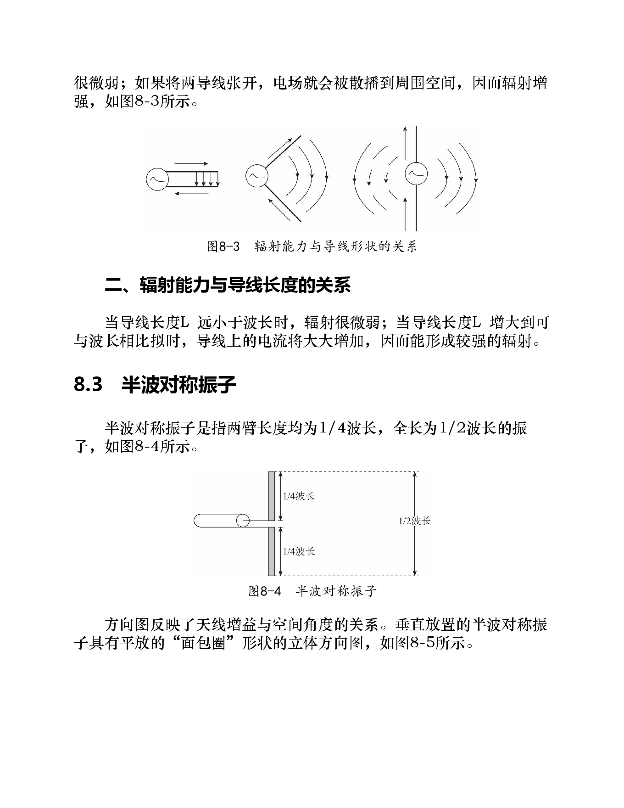
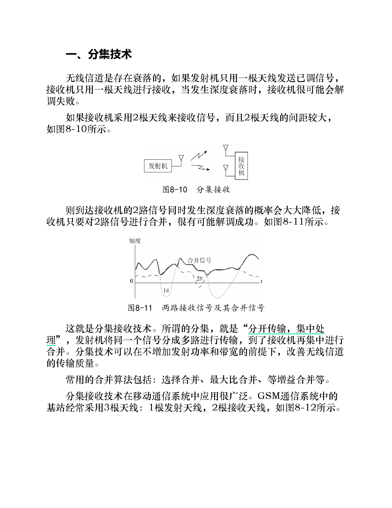
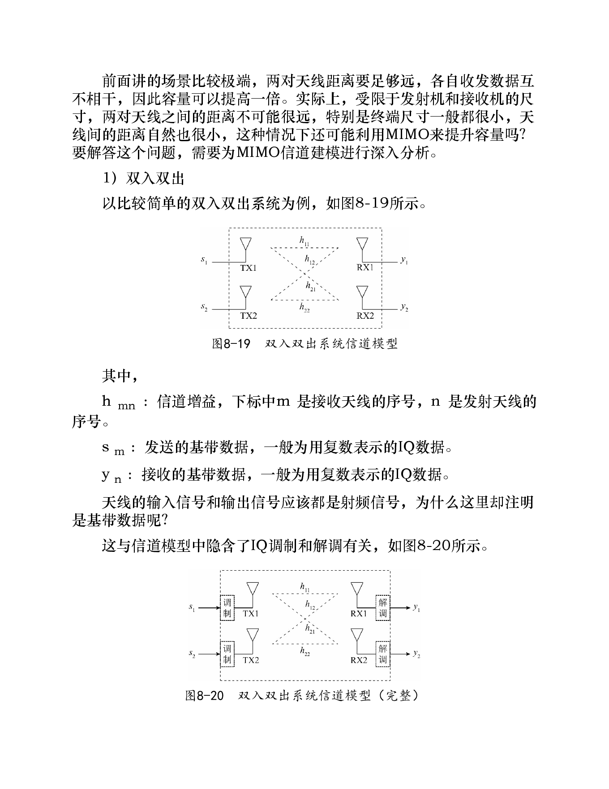
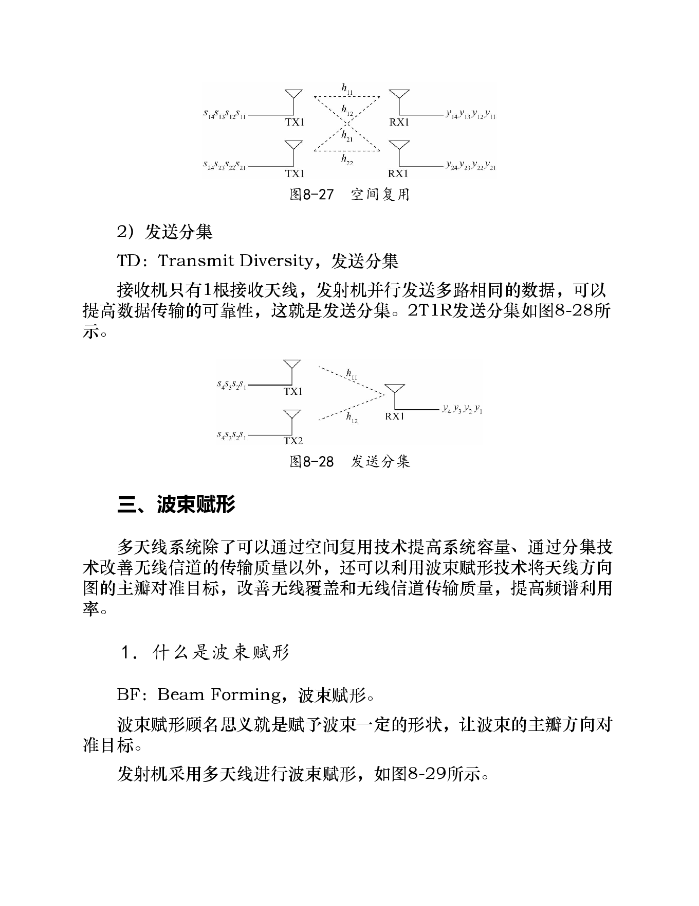
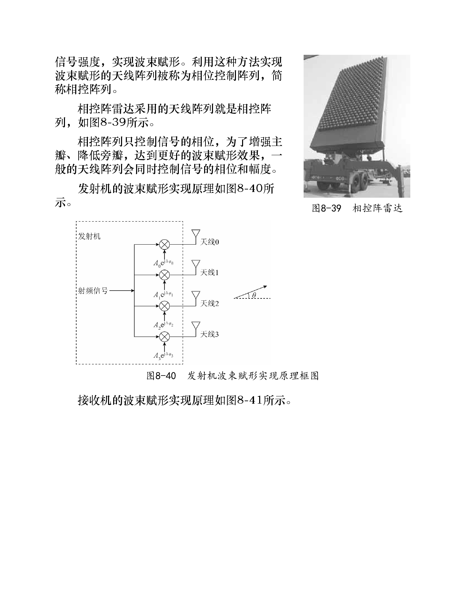

# 第8章 天线技术

> 本章关键词：[[天线]]、[[电磁波]]、[[射频信号]]、[[半波对称振子]]、[[方向图]]、[[全向天线]]、[[定向天线]]、[[天线阵列]]、[[分集技术]]、[[MIMO]]、[[信道矩阵]]、[[矩阵的秩]]、[[空间复用]]、[[发送分集]]、[[波束赋形]]。

## 知识点

### 8.1 天线的功能
- [ ] 发送端：射频电信号 → 电磁波
- [ ] 接收端：电磁波 → 射频电信号

### 8.2 电磁波辐射原理
- [ ] 一、辐射能力与导线形状的关系
- [ ] 二、辐射能力与导线长度的关系

### 8.3 半波对称振子
- [ ] 半波振子的结构
- [ ] 天线方向图
- [ ] 水平方向图与垂直方向图

### 8.4 全向天线
- [ ] 水平 360° 覆盖
- [ ] 垂直波瓣宽度与增益
- [ ] 垂直阵列提高水平方向增益

### 8.5 定向天线
- [ ] 扇区覆盖
- [ ] 反射板改变辐射方向

### 8.6 多天线技术
- [ ] 一、分集技术
- [ ] 二、MIMO
- [ ] 三、波束赋形

---

## 0. 本章总览

本章回答的是：**无线通信中的电信号如何真正进入空间传播，以及如何利用天线的空间特性改善通信性能。**

前面章节重点讲信号处理链路：

```text
比特 → 编码 → 脉冲成形 → 调制 → 射频电信号
```

但射频电信号仍然在电路中。要进行无线通信，还必须通过天线把它变成空间中的电磁波；接收端再用天线把电磁波变回射频电信号。

本章结构可以概括为：

```text
天线技术
  ├─ 天线功能：电信号 ↔ 电磁波
  ├─ 辐射原理：交变电流、导线形状、导线长度
  ├─ 基本天线：半波对称振子
  ├─ 覆盖类型：全向天线、定向天线
  └─ 多天线：分集、MIMO、波束赋形
```

---

# 8.1 天线的功能

天线的核心功能是完成两种物理形态之间的转换：

| 方向 | 转换过程 | 作用 |
|---|---|---|
| 发送端 | 射频电信号 → 电磁波 | 把电路中的信号辐射到自由空间 |
| 接收端 | 电磁波 → 射频电信号 | 把空间中的电磁波感应成电路信号 |

因此，天线处在通信系统模型中**射频前端与无线信道的交界处**。

可以把天线理解成：

> 无线通信系统和自由空间之间的“能量接口”。

如果没有天线，调制后的高频信号只能停留在导线或电路中，无法高效进入空间传播。

---

# 8.2 电磁波辐射原理

## 一、辐射能力与导线形状的关系

导线上有交变电流时，就可能向外辐射电磁波。但辐射强弱与导线结构有关。

### 1. 平行导线辐射弱

当两根导线平行且距离很近时，电场主要被约束在两根导线之间，向外扩散少，所以辐射很弱。

这类似传输线：能量沿着导线向前传输，而不是大量向空间辐射。

### 2. 张开导线辐射增强

如果把两根导线张开，电场线更容易扩展到周围空间，空间中的电场和磁场变化更明显，辐射能力增强。

直观理解：

```text
导线越像“封闭传输线” → 能量越被束缚 → 辐射弱
导线越向空间展开       → 电磁场越外泄 → 辐射强
```

---

## 二、辐射能力与导线长度的关系

导线长度与电磁波波长的相对关系也非常关键。

波长与频率关系：

$$
\lambda = \frac{c}{f}
$$

其中：

| 符号 | 含义 |
|---|---|
| $\lambda$ | 波长 |
| $c$ | 电磁波传播速度，空气中通常近似为光速 |
| $f$ | 频率 |

当导线长度 $L$ 远小于波长 $\lambda$ 时，导线上的电流分布不足以形成强辐射；当 $L$ 增大到可以与波长相比时，辐射能力会显著增强。

这也是为什么实际天线尺寸通常会设计成某个波长比例，例如 $\lambda/4$、$\lambda/2$。

---

# 8.3 半波对称振子

## 1. 结构

半波对称振子由两臂组成：

| 部分 | 长度 |
|---|---|
| 左臂 | $\lambda/4$ |
| 右臂 | $\lambda/4$ |
| 总长 | $\lambda/2$ |

所以它被称为**半波**对称振子。

半波对称振子是许多天线结构的基本单元。

---

## 2. 方向图

**方向图**描述天线增益随空间方向变化的关系。它回答的问题是：

> 天线在哪些方向辐射强，在哪些方向辐射弱？

垂直放置的半波对称振子的立体方向图类似一个平放的“面包圈”：

- 沿振子轴线方向辐射为零；
- 垂直于振子轴线的水平方向辐射最强；
- 水平平面内各方向辐射基本相同。

可概括为：

| 观察方向 | 特点 |
|---|---|
| 垂直方向图 | 轴线方向为零，水平方向最大 |
| 水平方向图 | 360° 基本均匀 |

这说明：半波对称振子本身就是一种水平全向天线。

---

# 8.4 全向天线

## 1. 全向天线的特点

全向天线的“全向”通常指**水平方向全向**，而不是三维空间所有方向都一样。

| 方向图 | 表现 |
|---|---|
| 水平方向图 | 360° 均匀辐射 |
| 垂直方向图 | 有一定波束宽度 |

在实际通信系统中，很多基站或读写器希望水平方向覆盖一圈用户或标签，因此会使用全向天线。

---

## 2. 波瓣宽度与增益

垂直方向上的波束不是越宽越好。

一般来说：

> 垂直波瓣越窄，能量越集中到需要覆盖的方向，天线增益越大。

这不是凭空增加能量，而是把原来分散到其他方向的能量集中到目标方向。

---

## 3. 阵列提高增益

单个半波振子的垂直波瓣较宽、增益较小。为了提高增益，可以把多个半波振子沿垂直方向排列成阵列。

例如垂直四元阵列：

- 水平方向仍保持全向覆盖；
- 垂直方向能量更集中；
- 因而水平方向覆盖能力增强。

直观理解：

```text
单个振子：能量比较分散
垂直阵列：把能量压向水平面 → 水平方向更强
```

---

# 8.5 定向天线

## 1. 定向天线的特点

定向天线不是向所有水平方向均匀辐射，而是在某个角度范围内重点辐射。

| 方向图 | 表现 |
|---|---|
| 水平方向图 | 只覆盖一定角度范围，有方向性 |
| 垂直方向图 | 有一定波束宽度，波瓣越窄增益越高 |

典型场景是蜂窝基站扇区覆盖：每个扇区天线只负责一个方向的区域。

---

## 2. 由全向到定向

书中给出的思路是：在全向天线基础上增加反射板，把原本向两侧或四周传播的能量反射到单侧方向，从而形成定向覆盖。

可以理解为：

```text
无反射板：水平方向近似全向
有反射板：后向辐射被抑制，前向辐射增强
```

这种方法本质上是改变天线的空间能量分布。

---

# 8.6 多天线技术

多天线技术不是简单地“多装几根天线”，而是利用多个空间通道来改善通信性能。

本节主要讲三类技术：

| 技术 | 主要目标 |
|---|---|
| 分集技术 | 提高可靠性，抗衰落 |
| MIMO | 提高容量或可靠性 |
| 波束赋形 | 把能量集中到目标方向 |

---

## 一、分集技术

### 1. 引入原因：无线信道衰落

无线信道存在衰落。单根天线接收时，如果刚好处在深度衰落位置，接收信号可能很弱，导致解调失败。

如果接收端使用两根或多根间距较大的天线，不同天线经历的衰落可能不同。多路信号同时深衰落的概率显著降低。

---

### 2. 分集思想

分集可以概括为：

> 分开传输 / 接收，集中处理。

接收分集的基本流程：

```text
多个接收天线收到多路信号 → 接收机合并 → 得到更可靠的信号
```

常见合并方法：

| 合并方法 | 思想 |
|---|---|
| 选择合并 | 选信号最好的一路 |
| 等增益合并 | 多路信号同等权重相加 |
| 最大比合并 | 按信道质量加权合并，质量越好权重越大 |

### 3. 分集的价值

分集技术可以在不增加发射功率、不增加带宽的情况下，提高无线传输质量。

本质是利用空间冗余降低深衰落风险。

---

## 二、MIMO

### 1. 基本概念

MIMO：Multiple-Input Multiple-Output，多输入多输出。

这里的输入 / 输出是相对于天线系统来说的：

| 系统 | 发射天线 | 接收天线 | 名称 |
|---|---:|---:|---|
| SISO | 1 | 1 | 单入单出 |
| SIMO | 1 | 多 | 单入多出，常见于接收分集 |
| MISO | 多 | 1 | 多入单出，常见于发送分集 / 波束赋形 |
| MIMO | 多 | 多 | 多入多出 |

---

### 2. 为什么 MIMO 能提高速率

SISO 信道容量受香农公式限制。在带宽和信噪比固定时，单根发射天线和单根接收天线之间的最大速率有限。

MIMO 的直观思想是：

> 如果空间中能形成多条相互独立的传输通道，就可以并行传多路数据。

极端情况下，若有 $N$ 条互不干扰的独立通道，容量可近似提高为单通道的 $N$ 倍。

---

### 3. MIMO 信道模型

对 $N_t$ 根发射天线、$N_r$ 根接收天线的 MIMO 系统，可用矩阵表示：

$$
Y = HS
$$

其中：

| 符号 | 含义 |
|---|---|
| $S$ | 发射端输入基带数据矩阵 / 向量 |
| $Y$ | 接收端输出基带数据矩阵 / 向量 |
| $H$ | 信道矩阵 |
| $N_t$ | 发射天线数 |
| $N_r$ | 接收天线数 |

信道矩阵 $H$ 的大小为：

$$
N_r \times N_t
$$

矩阵元素 $h_{mn}$ 表示：

> 第 $n$ 根发射天线到第 $m$ 根接收天线之间的信道增益。

注意：书中建模时使用的是基带数据，这是因为模型中已经隐含了 IQ 调制和 IQ 解调过程。

---

### 4. 信道矩阵的特殊情况

#### 情况 A：天线间距足够大

如果不同收发天线对之间几乎互不干扰，则信道矩阵近似为对角阵：

$$
H=\begin{bmatrix}
h_{11} & 0 & \cdots & 0 \\
0 & h_{22} & \cdots & 0 \\
\vdots & \vdots & \ddots & \vdots \\
0 & 0 & \cdots & h_{NN}
\end{bmatrix}
$$

这时可以并行传输多路数据。

#### 情况 B：接收天线间距很小

同一发射天线到不同接收天线的信道增益几乎相同，信道矩阵中同一列元素相近或相同。接收端得到的方程缺乏独立性，难以分离多路数据。

#### 情况 C：发射天线间距很小

不同发射天线到同一接收天线的信道增益几乎相同，信道矩阵中同一行元素相近或相同。接收端同样难以区分多路输入。

---

### 5. 信道矩阵的秩决定并行数据路数

MIMO 能并行传几路数据，取决于信道矩阵中有多少独立的空间维度。

这个数量由矩阵的秩决定：

$$
\text{并行数据路数} = \operatorname{rank}(H)
$$

并且最大不超过：

$$
r_{\max}=\min(N_t,N_r)
$$

直观理解：

| 信道矩阵情况 | 空间通道独立性 | 可并行数据路数 |
|---|---|---|
| 行 / 列高度相关 | 低 | 少 |
| 行 / 列线性无关 | 高 | 多 |
| 满秩 | 最好 | $\min(N_t,N_r)$ |

---

### 6. 空间复用与发送分集

MIMO 中多根天线可以发送不同数据，也可以发送相同数据。

| 方式 | 发送内容 | 目标 |
|---|---|---|
| 空间复用（SM） | 多路不同数据 | 提高吞吐量 |
| 发送分集（TD） | 多路相同数据 | 提高可靠性 |

当信道质量好、信道矩阵秩较高时，适合空间复用；当信道质量差或更关注可靠性时，适合分集。

---

## 三、波束赋形

### 1. 基本概念

波束赋形（Beam Forming, BF）是利用多天线控制辐射方向，使天线方向图的主瓣对准目标。

目标：

- 目标方向：相涨干涉，信号增强；
- 非目标方向：尽量减少能量泄漏或形成较低旁瓣。

---

### 2. 基本原理：控制相位实现相涨干涉

多个天线发出同频信号。如果这些信号到达目标点时相位相同，就会相涨干涉，叠加后幅度增强。

如果到达目标点时相位相反，就会相消干涉，信号变弱。

波束赋形要做的就是：

> 根据目标方向和天线间距，调整各天线发射 / 接收信号的相位或延迟，使目标方向上相位对齐。

---

### 3. 相邻天线的相位差

设：

| 符号 | 含义 |
|---|---|
| $d$ | 相邻天线间距 |
| $\theta$ | 电波传播方向角 |
| $\lambda$ | 波长 |
| $c$ | 光速 |

相邻天线到远处目标的路径差通常与 $d\sin\theta$ 有关，因此相位差可写为近似形式：

$$
\Delta \varphi = \frac{2\pi d\sin\theta}{\lambda}
$$

对应的延迟量为：

$$
\tau = \frac{d\sin\theta}{c}
$$

通过给不同天线施加合适的相位补偿或时间延迟，就能让信号在目标方向上同相叠加。

---

### 4. 实现方式

书中提到，相控阵列通过控制各阵元信号相位实现波束赋形；工程系统中为了增强主瓣、降低旁瓣，通常还会同时控制幅度。

| 控制量 | 作用 |
|---|---|
| 相位 | 决定主瓣指向 |
| 幅度 | 控制主瓣 / 旁瓣形状 |

因此，波束赋形本质上是对天线阵列中各路信号进行加权。

---

## 和 RFID 的关系

### 1. RFID 读写器与标签都离不开天线

UHF RFID 中，读写器通过天线发射射频能量和命令，标签通过天线接收能量、解调命令，并通过反向散射改变天线负载来返回信息。

因此天线直接影响：

- 标签能否被激活；
- 读写距离；
- 读写稳定性；
- 多标签环境中的覆盖范围；
- 标签方向变化时的识别概率。

### 2. 方向图对应覆盖区域

读写器使用定向天线时，可以把能量集中到货架、门禁通道、传送带等目标区域；使用全向或多天线布局时，可以扩大覆盖范围。

### 3. 分集思想可用于提高读取可靠性

RFID 场景常有多径、遮挡、标签姿态变化。多天线读写器或多位置读写器可以利用空间分集降低漏读概率。

---

## 本章公式清单

| 公式 | 含义 |
|---|---|
| $\lambda=\frac{c}{f}$ | 波长与频率关系 |
| $Y=HS$ | MIMO 输入、信道、输出关系 |
| $r_{\max}=\min(N_t,N_r)$ | MIMO 最大空间流数上限 |
| $\Delta\varphi=\frac{2\pi d\sin\theta}{\lambda}$ | 阵列相邻天线方向相位差 |
| $\tau=\frac{d\sin\theta}{c}$ | 相邻天线补偿延迟 |

## 易混点

- “全向天线”通常指水平方向全向，不代表三维各方向辐射都相同。
- 天线增益不是增加总功率，而是改变能量在空间中的分布。
- MIMO 不是天线越多速率一定越高，关键看信道矩阵的秩。
- 分集更偏可靠性，空间复用更偏吞吐量，波束赋形更偏方向性覆盖和信号增强。

## 疑问 / 后续

- [ ] RFID 标签天线为什么常做成偶极子、折叠偶极子或环形结构？
- [ ] UHF RFID 读写器常用圆极化天线的原因是什么？
- [ ] 多读写器环境下，能否用波束赋形降低串扰？

## 相关笔记

- [[RFID/入门资料3/深入浅出通信原理-阅读笔记/07 第7章 频带信号的发送和接收]]
- [[RFID/入门资料3/深入浅出通信原理-阅读笔记/09 第9章 复用和多址技术]]
- [[RFID/入门资料2/C1G2读书笔记]]

## 原书关键图示










