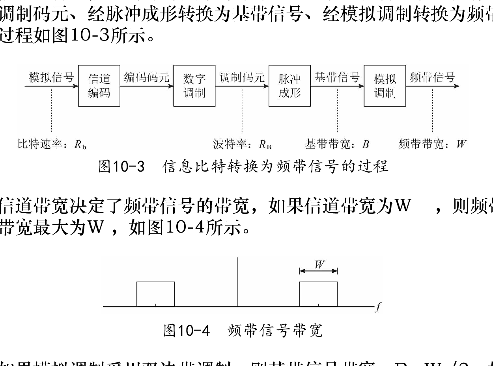
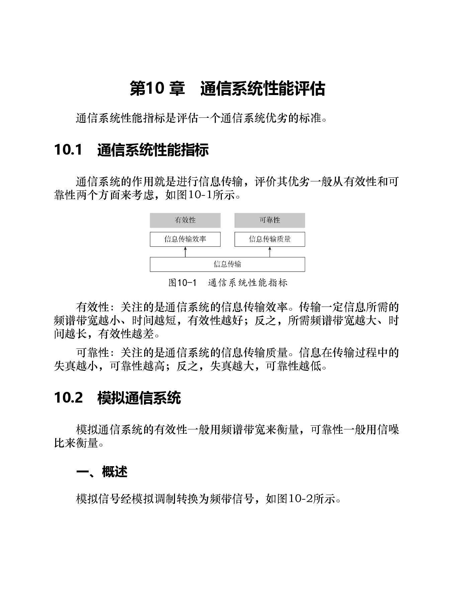
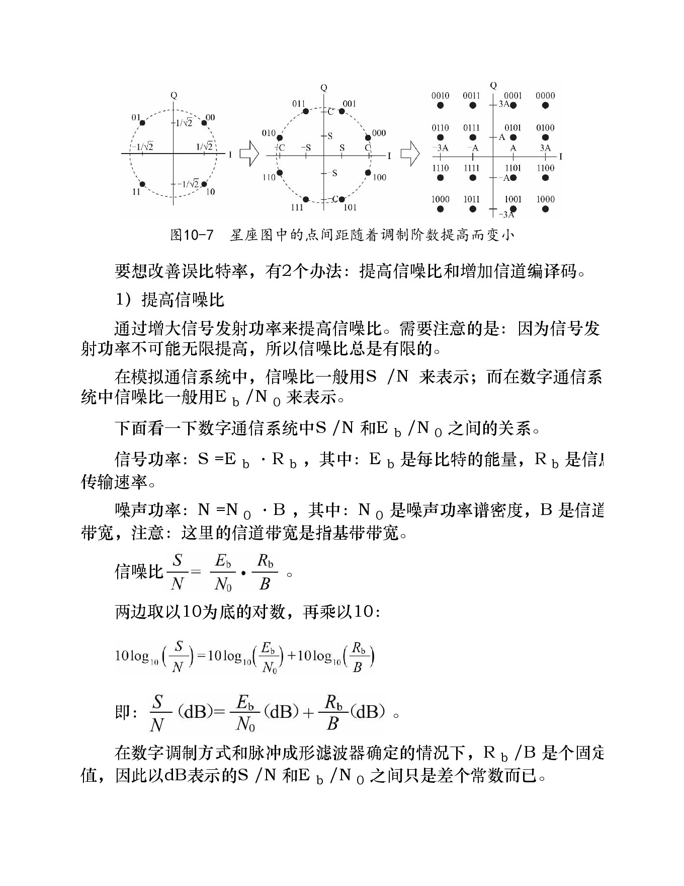
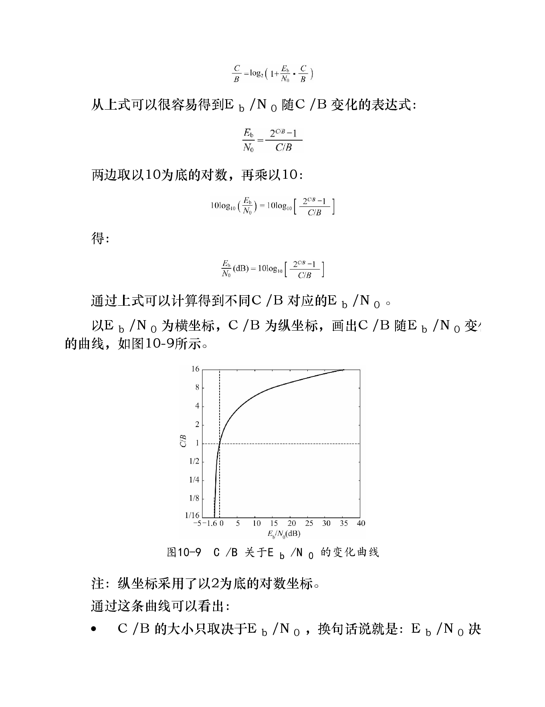
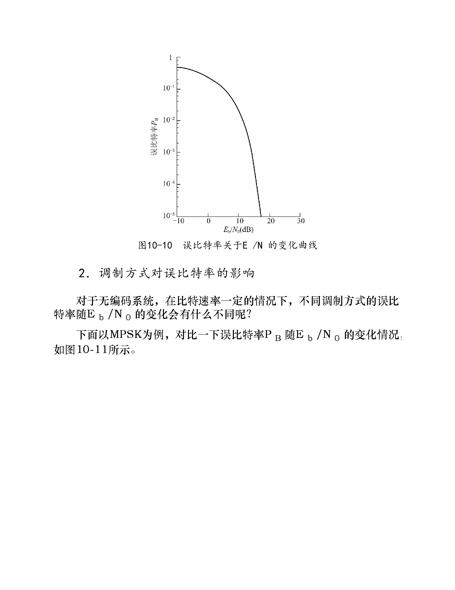
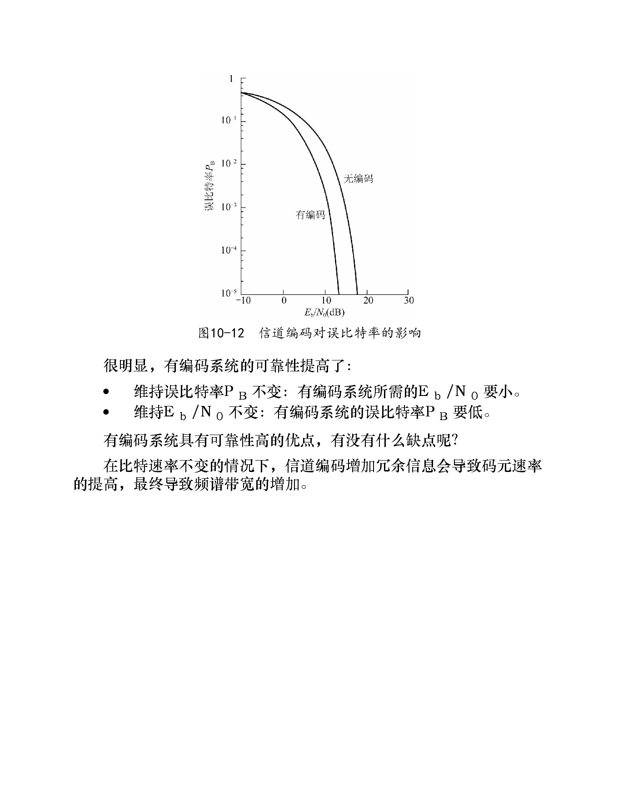

# 第10章 通信系统性能评估

> 本章关键词：[[通信系统性能指标]]、[[有效性]]、[[可靠性]]、[[频谱带宽]]、[[信噪比]]、[[频谱资源利用率]]、[[误比特率]]、[[码元速率]]、[[比特速率]]、[[Eb/N0]]、[[香农公式]]、[[香农极限]]、[[信道编码]]。

## 知识点

### 10.1 通信系统性能指标
- [ ] 有效性
- [ ] 可靠性

### 10.2 模拟通信系统
- [ ] 一、概述
- [ ] 二、有效性
- [ ] 三、可靠性

### 10.3 数字通信系统
- [ ] 一、概述
- [ ] 二、有效性
- [ ] 三、可靠性

---

## 0. 本章总览

本章回答的问题是：**如何评价一个通信系统好不好。**

评价通信系统主要看两个方面：

| 指标 | 关注问题 | 典型度量 |
|---|---|---|
| 有效性 | 传得快不快、省不省资源 | 带宽、频谱资源利用率 |
| 可靠性 | 传得准不准、失真/错误多不多 | 信噪比、误比特率 |

可以概括为：

```text
有效性：少占带宽 / 少花时间 / 高吞吐
可靠性：少失真 / 少误码 / 高成功率
```

通信系统设计往往是在有效性和可靠性之间做折中。

---

# 10.1 通信系统性能指标

## 1. 有效性

有效性关注信息传输效率。

同样传输一段信息：

- 占用频谱带宽越小，有效性越好；
- 传输时间越短，有效性越好；
- 单位带宽内传输的比特越多，有效性越好。

对数字通信系统，常用**频谱资源利用率**衡量有效性。

---

## 2. 可靠性

可靠性关注信息传输质量。

- 模拟通信中，可靠性体现为失真小、信噪比高；
- 数字通信中，可靠性体现为误码少、误比特率低。

可靠性提高通常需要付出代价，例如：

- 提高发射功率；
- 降低调制阶数；
- 增加信道编码冗余；
- 增加带宽或时间资源。

---

# 10.2 模拟通信系统

模拟通信系统通常把模拟信号通过模拟调制变成频带信号。

## 一、概述

模拟通信系统的性能评价：

| 维度 | 常用指标 |
|---|---|
| 有效性 | 频谱带宽 |
| 可靠性 | 信噪比 S/N |

---

## 二、有效性

若传输的信息相同、传输时间相同，则模拟通信系统的有效性主要由占用带宽决定：

> 带宽越窄，有效性越好；带宽越宽，有效性越差。

例子：

| 系统 | 每频道带宽 | 有效性 |
|---|---:|---|
| 中波 AM 广播 | 约 9 kHz 以内 | 较高 |
| FM 广播 | 约 200 kHz 以内 | 较低 |

从“省频谱”的角度看，AM 更有效；但这不代表 AM 整体更好，因为可靠性还要单独评价。

---

## 三、可靠性

模拟系统可靠性主要看信噪比：

> 信噪比越高，失真越小，可靠性越高。

AM 和 FM 的对比：

| 系统 | 抗干扰特点 | 可靠性 |
|---|---|---|
| AM | 干扰会直接改变幅度，影响包络解调 | 较差 |
| FM | 幅度干扰可被限幅削弱，信息主要在频率变化中 | 较好 |

因此 AM 与 FM 体现了一个典型折中：

```text
AM：带宽省，但抗干扰弱
FM：带宽大，但抗干扰强
```

---

# 10.3 数字通信系统

数字通信系统评价更关注：

| 维度 | 常用指标 |
|---|---|
| 有效性 | 频谱资源利用率 |
| 可靠性 | 误比特率 BER |

---

## 一、数字通信系统信号链路

数字信号转换为频带信号的大致过程：

```text
信息比特
  → 信道编码：增加冗余，提升纠错能力
  → 数字调制 / 星座映射：比特映射为调制码元
  → 脉冲成形：调制码元变成基带波形
  → 模拟调制：基带信号搬移到载波频率
  → 频带信号
```



*该图把 $R_b$、$R_B$、基带带宽 $B$ 与频带带宽 $W$ 标在同一条处理链上；双边带调制下，后文将用到 $B=W/2$。*

---

## 二、带宽、码元速率与比特速率

假设信道频带带宽为 $W$，采用双边带调制，则基带带宽为：

$$
B=\frac{W}{2}
$$

若脉冲成形采用理想低通滤波器 / sinc 脉冲，则调制码元波特率为：

$$
R_B=2B=W
$$

对于 MPSK / MQAM 调制，一个调制码元携带 $\log_2M$ 个比特，因此不考虑信道编码时：

$$
R_b=R_B\log_2M
$$

例子：

| 调制方式 | 每码元比特数 | 比特速率关系 |
|---|---:|---|
| QPSK | 2 | $R_b=2R_B$ |
| 8PSK | 3 | $R_b=3R_B$ |
| 16QAM | 4 | $R_b=4R_B$ |

结论：

> 在码元速率固定时，提高调制阶数可以提高比特速率。

---

## 三、高阶调制的代价

调制阶数越高，星座图中的点越密，点间距越小。

这意味着：

- 同样噪声下更容易判错；
- 误比特率升高；
- 需要更高的信噪比维持相同可靠性。

因此不能无限提高调制阶数。

---

## 四、$S/N$ 与 $E_b/N_0$ 的关系

在模拟系统中常用 $S/N$ 表示信噪比；数字系统中常用 $E_b/N_0$。

定义：

| 符号 | 含义 |
|---|---|
| $S$ | 信号功率 |
| $N$ | 噪声功率 |
| $E_b$ | 每比特能量 |
| $R_b$ | 比特速率 |
| $N_0$ | 噪声功率谱密度 |
| $B$ | 基带带宽 |

有：

$$
S=E_bR_b
$$

$$
N=N_0B
$$

因此：

$$
\frac{S}{N}=\frac{E_b}{N_0}\cdot\frac{R_b}{B}
$$

用 dB 表示：

$$
\left(\frac{S}{N}\right)_{dB}
=
\left(\frac{E_b}{N_0}\right)_{dB}
+10\log_{10}\left(\frac{R_b}{B}\right)
$$

这说明：在调制方式和脉冲成形确定时，$S/N$ 与 $E_b/N_0$ 只差一个与频谱效率相关的常数。

---

## 五、信道编码的影响

信道编码通过增加冗余信息来提升纠错能力。

优点：

- 降低误比特率；
- 在相同 BER 要求下可降低所需 $E_b/N_0$；
- 提高可靠性。

代价：

- 若信息比特速率不变，编码后码元数增加；
- 码元速率提高；
- 所需带宽增加；
- 有效性下降。

典型折中：

```text
加编码 → 可靠性提高，但占用更多资源
高阶调制 → 有效性提高，但可靠性下降
```

---

# 10.3.2 数字通信系统的有效性

## 1. 频谱资源利用率定义

数字通信系统有效性常用频谱资源利用率衡量。

以基带带宽为分母：

$$
\eta_B=\frac{R_b}{B}\quad (\text{bit/s/Hz})
$$

以频带带宽为分母：

$$
\eta_W=\frac{R_b}{W}\quad (\text{bit/s/Hz})
$$

若采用双边带调制，$W=2B$，所以：

$$
\eta_W=\frac{1}{2}\eta_B
$$

---

## 2. 频谱资源利用率的最大值

香农公式：

$$
C=B\log_2\left(1+\frac{S}{N}\right)
$$

当信息速率达到信道容量时，$R_b=C$。又因为：

$$
\frac{S}{N}=\frac{E_b}{N_0}\cdot\frac{C}{B}
$$

代入香农公式可得：

$$
\frac{C}{B}=\log_2\left(1+\frac{E_b}{N_0}\cdot\frac{C}{B}\right)
$$

整理得到：

$$
\frac{E_b}{N_0}=\frac{2^{C/B}-1}{C/B}
$$

这个式子说明：

> 给定 $E_b/N_0$，频谱资源利用率 $C/B$ 存在理论上限。

---

## 3. 香农极限

当 $C/B$ 趋近于 0 时，可以得到最低的 $E_b/N_0$ 极限，约为：

$$
\frac{E_b}{N_0}\approx -1.6\text{ dB}
$$

这就是香农极限。

含义：

- 若 $E_b/N_0>-1.6\text{ dB}$，理论上可以通过足够低的频谱效率和合适编码实现可靠传输；
- 若 $E_b/N_0<-1.6\text{ dB}$，理论上无法实现无差错传输。

---

# 10.3.3 数字通信系统的可靠性

## 1. BER 与 $E_b/N_0$

数字通信可靠性一般用误比特率 $P_B$ 或 BER 衡量。

在比特速率和调制编码方式确定时：

> $E_b/N_0$ 越大，BER 越低。

这是数字通信性能曲线中最常见的一类关系。

---

## 2. 调制方式对 BER 的影响

以 MPSK 为例，在无编码、比特速率相同的情况下：

| 条件 | 调制阶数 $M$ 增大时 |
|---|---|
| BER 固定 | 所需 $E_b/N_0$ 增大 |
| $E_b/N_0$ 固定 | BER 增大 |

原因是高阶调制星座点更密，抗噪声能力更弱。

但高阶调制仍然有价值，因为它可以降低码元速率、减少带宽占用，提高频谱效率。

---

## 3. 信道编码对 BER 的影响

在比特速率和调制方式固定时，有编码系统相比无编码系统：

| 条件 | 有编码系统表现 |
|---|---|
| BER 固定 | 所需 $E_b/N_0$ 更低 |
| $E_b/N_0$ 固定 | BER 更低 |

这体现了编码增益。

但编码的代价是增加冗余，可能增加码元速率和带宽。

---

## 综合理解：有效性与可靠性的折中

| 方法 | 有效性 | 可靠性 | 代价 / 风险 |
|---|---|---|---|
| 提高调制阶数 | 提高 | 降低 | 需要更高 SNR |
| 降低调制阶数 | 降低 | 提高 | 速率下降 |
| 增加信道编码 | 降低 | 提高 | 冗余增加、带宽增加 |
| 提高发射功率 | 不直接改变 | 提高 | 功耗、法规限制、干扰增加 |
| 增加带宽 | 可能提高吞吐 | 可降低 SNR 要求 | 频谱资源消耗 |

通信系统设计的核心就是在这些因素之间取平衡。

---

## 和 RFID 的关系

### 1. RFID 协议评价同样离不开有效性与可靠性

在 RFID 课题中，常见性能指标可以放入本章框架：

| RFID 指标 | 对应本章概念 |
|---|---|
| 盘点吞吐量 | 有效性 |
| 识别时延 | 有效性 |
| 漏读率 / 读成功率 | 可靠性 |
| 碰撞概率 | 可靠性 / MAC 层效率 |
| BER / CRC 错误 | 可靠性 |
| 读写距离 | 链路预算与可靠性 |

### 2. C1G2 中 CRC 与可靠性

[[RFID/入门资料2/C1G2读书笔记]]中提到标签回复包含 CRC。CRC 不能直接纠错，但可以检测错误帧，避免读写器把错误比特当成有效数据。

### 3. Q 参数与系统有效性

C1G2 中 Q 控制标签选择时隙的范围。Q 太小，碰撞多；Q 太大，空闲时隙多。

因此 Q 的选择影响：

- 盘点时间；
- 吞吐量；
- 碰撞概率；
- 多标签识别效率。

这属于 MAC 层的有效性 / 可靠性折中。

### 4. 物理层和 MAC 层要分开看

RFID 盘点失败可能来自两类原因：

| 层次 | 失败原因 |
|---|---|
| 物理层 | 信号弱、噪声大、多径衰落、标签姿态不佳 |
| MAC 层 | 多标签同时回复导致碰撞、Q 设置不合适 |

本章主要提供物理层性能评估语言；结合第 9 章和 C1G2 可进一步分析 MAC 层吞吐。

---

## 本章公式清单

| 公式 | 含义 |
|---|---|
| $B=W/2$ | 双边带调制下基带带宽与频带带宽关系 |
| $R_B=2B$ | 理想低通 / sinc 脉冲下码元速率 |
| $R_b=R_B\log_2M$ | MPSK / MQAM 比特速率关系 |
| $S=E_bR_b$ | 信号功率与每比特能量关系 |
| $N=N_0B$ | 噪声功率与噪声谱密度关系 |
| $\frac{S}{N}=\frac{E_b}{N_0}\frac{R_b}{B}$ | 模拟信噪比与数字信噪比关系 |
| $\eta_B=R_b/B$ | 基带频谱资源利用率 |
| $C=B\log_2(1+S/N)$ | 香农容量公式 |
| $\frac{E_b}{N_0}=\frac{2^{C/B}-1}{C/B}$ | 给定频谱效率对应的理论能量需求 |

## 易混点

- 高阶调制提高频谱效率，但会降低抗噪声能力。
- 信道编码提高可靠性，但引入冗余，可能降低有效性。
- $S/N$ 和 $E_b/N_0$ 不是同一个量，但可通过 $R_b/B$ 转换。
- 香农极限是理论极限，不是具体系统一定能达到的工程性能。

## 疑问 / 后续

- [ ] RFID C1G2 的链路预算如何与读距联系起来？
- [ ] 标签回复 BLF、编码方式与频谱占用如何计算？
- [ ] 盘点吞吐量是否可以建立类似“频谱效率”的评价指标？

## 相关笔记

- [[RFID/入门资料3/深入浅出通信原理-阅读笔记/06 第6章 基带信号的发送和接收]]
- [[RFID/入门资料3/深入浅出通信原理-阅读笔记/07 第7章 频带信号的发送和接收]]
- [[RFID/入门资料3/深入浅出通信原理-阅读笔记/09 第9章 复用和多址技术]]
- [[RFID/入门资料2/C1G2读书笔记]]

## 原书关键图示










