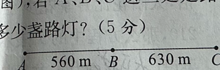
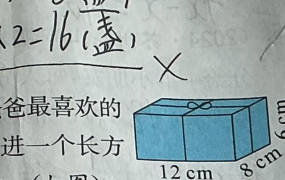
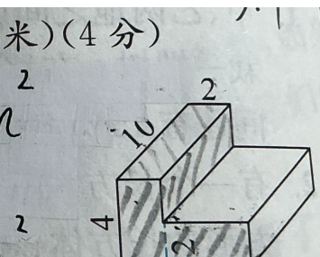
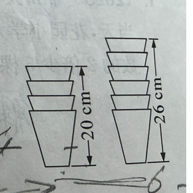

# 错题整理

## 1. 在括号里填最简分数

24 千克 =（　　　）吨  
450 毫升 =（　　　）升  
4 米 20 厘米 =（　　　）米  
320 公顷 =（　　　）平方千米

---

## 2. 时间单位与比较

（2025·南通如东县期末）有研究发现，人眨一次眼大约需要 $\frac{1}{5}$ 秒，而在文学上用来表示时间极短的词“一瞬间”约为 $0.36$ 秒，“一刹那”约为 $0.018$ 秒。

（1）题中“$\frac{1}{5}$ 秒”表示（　　　）的时间占（　　　）的 $\frac{1}{5}$。

（2）把这几个时间按从长到短的顺序排列起来：

（　　　）秒 >（　　　）秒 >（　　　）秒，表示时间最短的是（　　　）。

---

## 3. 估算判断

（2025·南京六合区期末）用估算的方法判断 $\frac{1}{10}+\frac{4}{7}$ 的和是否大于 $\frac{1}{2}$，以下方法最合理的是（　　　）。

A. 因为 $\frac{4}{7}>\frac{1}{2}$，所以 $\frac{1}{10}+\frac{4}{7}>\frac{1}{2}$

B. 因为 $\frac{1}{10}+\frac{4}{7}=\frac{7}{70}+\frac{40}{70}=\frac{47}{70}$，所以 $\frac{1}{10}+\frac{4}{7}>\frac{1}{2}$

C. 因为 $\frac{1}{10}+\frac{4}{7}=\frac{5}{17}$，所以 $\frac{1}{10}+\frac{4}{7}<\frac{1}{2}$

---

## 4. 计算

$$
\frac{13}{19}-\frac{3}{8}+\frac{6}{19}+\frac{5}{8}
$$

答：　　　　　　　　　　　　　　　　　　　　　　　　

---

## 5. 校园运动会

学校举办了精彩的校园运动会，各个年级的同学都踊跃参与。一年级参赛人数占参赛总人数的 $\frac{1}{10}$，三年级参赛人数占参赛总人数的 $\frac{3}{16}$，五年级参赛人数占参赛总人数的 $\frac{1}{3}$，四、五、六年级参赛人数共占参赛总人数的 $\frac{5}{8}$。

（1）一、三、五年级参赛人数共占参赛总人数的几分之几？

答：　　　　　　　　　　　　　　　　　　　　　　　　

---

## 6. 等腰三角形广告牌

（2025·苏州常熟市期末改编）学校组织爱心义卖，各班正在自制广告牌。五年级一班制作的广告牌是等腰三角形，一条边长 $\frac{1}{4}$ 米，另一条边长 $\frac{2}{5}$ 米。在广告牌的周边粘一圈丝带，丝带至少长多少米？

答：　　　　　　　　　　　　　　　　　　　　　　　　

---

## 7. 最大公因数与最小公倍数

$A$ 和 $B$ 都是自然数，把它们分解质因数是 $A=2\times5\times a$，$B=3\times5\times a$，则 $A$ 和 $B$ 的最大公因数是（　　　）。如果 $A$ 和 $B$ 的最小公倍数是 60，那么 $a=$（　　　）。

---

## 8. 日工资

李叔叔是一名社区环保专员，每天负责可回收物的上门回收。他每日的基本工资是 120 元，每回收一件可回收物额外奖励 0.7 元。如果李叔叔每天回收 $a$ 件可回收物，那么他的日工资是（　　　）元；6 月 25 日这一天，李叔叔的日工资是 225 元，他回收了（　　　）件可回收物。

---

## 9. 节水桶

亮亮家的节水桶容量是 $\frac{9}{2}$ 升，装满水后，第一次用了它的 $\frac{1}{3}$，还剩（　　　）；如果第一次用了 $\frac{1}{3}$ 升，那么还剩（　　　）升。

---

## 10. 植树增绿

绿水青山就是金山银山。六年级的同学们在植树活动中种了 90 棵松树和一些柏树，种的柏树的棵数比松树的 $\frac{2}{5}$ 多，比松树的 $\frac{2}{3}$ 少。柏树最少种了（　　　）棵，最多种了（　　　）棵。

---

## 11. 混合能源路灯

某社区在 198 米长的绿化带一侧装节能路灯，太阳能路灯每隔 6 米装一盏，风能路灯每隔 9 米装一盏。为避免重复布线，两种路灯同时需要安装的位置改装一盏混合能源路灯，那么除两端外，中间要装多少盏混合能源路灯？

答：　　　　　　　　　　　　　　　　　　　　　　　　

---

## 12. 结论补充

水果超市新购进 4 种水果，分别是苹果、香蕉、梨和桃。

① 这批水果的总质量是 800 千克。  
② 香蕉和苹果的总质量是 600 千克。  
③ 苹果的质量是桃质量的 4.5 倍。  
④ 苹果的质量比桃多 280 千克。  
⑤ 苹果的质量比香蕉的 2 倍少 120 千克。

要想知道苹果的质量为多少千克，需要以上信息（　　　）（填序号）。根据所选信息，列方程计算出苹果的质量。

答：　　　　　　　　　　　　　　　　　　　　　　　　

---

## 13. 路灯安装

（2025·苏州昆山市期末）工程队要在 $AC$ 这条新修的马路一侧等距离地安装路灯（如下图），若 $A$、$B$、$C$ 这三处是路灯的必装点，则至少需要安装多少盏路灯？

答：　　　　　　　　　　　　　　　　　　　　　　　　

---

## 14. 礼盒

爸爸的生日就要到了，天天买了爸爸最喜欢的茶叶作为生日礼物。他把茶叶放进一个长方体礼盒里，并用彩带捆扎这个礼盒。（如下图）

（1）这个礼盒的体积是多少立方厘米？

答：　　　　　　　　　　　　　　　　　　　　　　　　

（2）“十字系法”是捆扎礼盒的基本方法，优雅且对称。如图，捆扎礼盒时打结处用了 12 厘米彩带，捆扎这个礼盒至少需要准备多长的彩带？

答：　　　　　　　　　　　　　　　　　　　　　　　　

---

## 15. 计算下面各题，能简算的要简算

（1）$\frac{5}{6}-\frac{1}{4}+\frac{2}{3}=$  

　　　　　　　　　　　　　　　　　　　　　　　　

（2）$\frac{23}{24}\times\frac{8}{69}\times\frac{5}{4}=$  

　　　　　　　　　　　　　　　　　　　　　　　　

（3）$\frac{9}{14}-\left(\frac{1}{4}+\frac{5}{14}\right)+\frac{1}{4}=$  

　　　　　　　　　　　　　　　　　　　　　　　　

（4）$\frac{9}{10}\times\frac{2}{3}\times\frac{5}{6}=$  

　　　　　　　　　　　　　　　　　　　　　　　　

---

## 16. 解方程

（1）$0.4\times6+3x=4.8$  

　　　　　　　　　　　　　　　　　　　　　　　　

（2）$3x-\frac{2}{3}=\frac{1}{3}$  

　　　　　　　　　　　　　　　　　　　　　　　　

（3）$x-0.3x=1.05$  

　　　　　　　　　　　　　　　　　　　　　　　　

---

## 17. 分数意义

（2025·南京高淳区期末）一根 2 米长的绳子正好包扎了 9 个粽子，平均每个粽子用去（　　　）米绳子，包扎 4 个粽子的绳子正好占这根绳子的（　　　）。

---

## 18. 稻谷与米

100 千克稻谷可碾米 75 千克，每千克稻谷可碾米（　　　）千克，碾 1 千克米需稻谷（　　　）千克。

---

## 19. 修路

工程队修一条长 $\frac{11}{12}$ 千米的路，第一天修了这条路的 $\frac{1}{3}$，第二天修了这条路的 $\frac{2}{7}$，第三天再修这条路的几分之几就能修好这条路的 $\frac{5}{6}$？

答：　　　　　　　　　　　　　　　　　　　　　　　　

---

## 20. 豆类食品

随着大家越来越注重养生，豆类食品越来越受到大家的欢迎，黄豆、红豆和黑豆都是常见的豆类。某超市运来这三种豆共 $\frac{5}{4}$ 吨，已知黄豆和红豆共重 $\frac{2}{3}$ 吨，红豆和黑豆共重 $\frac{4}{5}$ 吨，红豆运来多少吨？

答：　　　　　　　　　　　　　　　　　　　　　　　　

---

## 21. 组合体的体积和表面积

求下面图形的体积和表面积。（单位：厘米）

体积：　　　　　　　　　　　　　　　　　　　　　　　　

表面积：　　　　　　　　　　　　　　　　　　　　　　　

---

## 22. 杯子叠放

把一些规格相同的杯子叠起来（如图），4 个杯子叠起来高 20 厘米，6 个杯子叠起来高 26 厘米。$n$ 个杯子叠起来的高度可以用关系式（　　　）来表示。

A. $6n-10$

B. $3n+8$

C. $3n+11$

D. $6n+6$
